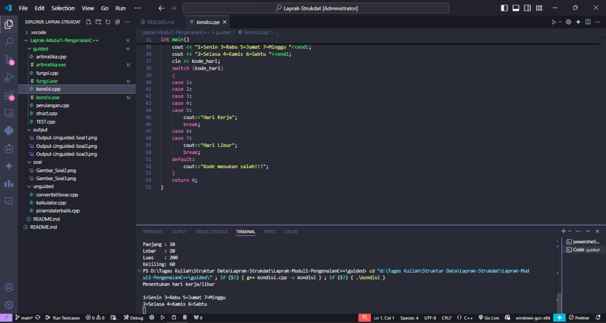

# <h1 align="center">Laporan Praktikum Modul 1<br>Pengenalan C++</h1>
<p align="center">Arkaan Wisnu Pratama - 103112430118</p>

## Dasar Teori

C++ itu bahasa pemrograman yang populer banget buat belajar dasar-dasar ngoding. Di dalamnya ada konsep variabel, operator aritmatika, percabangan, perulangan, fungsi, sampai struct. Hal-hal ini jadi pondasi utama sebelum lanjut ke materi yang lebih kompleks.

Terus, konsep fungsi sama prosedur juga penting. Fungsi biasanya ngembaliin nilai, sedangkan prosedur cuma nampilin hasil aja tanpa balikin apa-apa. Dari situ kita bisa belajar gimana cara bikin program yang lebih terstruktur dan gampang diatur.

Selain itu, C++ juga ngenalin kita ke logika pemrograman kayak kondisi if, switch, perulangan for, while, dan do-while. Ditambah ada struct buat ngelompokin data biar lebih rapi. Jadi modul ini sebenernya ngajarin dasar-dasar yang bakal terus kepake di program lebih besar nantinya.

## Guided

### Soal 1 Aritmatika
```cpp
#include <iostream>
using namespace std;
int main()
{
    int W, X, Y;
    float Z;
    X = 7;
    Y = 3;
    W = 1;
    Z = (X + Y) / (Y + W);
    cout << "Nilai z = " << Z << endl;
    return 0;
}
```
> 

Jadi di kode itu ada variabel X, Y, W pake tipe integer, sama Z tipe float. Nilai masing-masing diisi X=7, Y=3, dan W=1. Terus dihitung rumus (X+Y)/(Y+W) yang berarti 10/4. Karena dia bagiannya integer, hasilnya jadi 2 bukan 2.5, baru dikonversi ke float. Hasil akhirnya ditampilin ke layar dengan tulisan "Nilai z = 2".

### Soal 2 Fungsi
```cpp
#include <iostream>
using namespace std;

// Prosedur: hanya menampilkan hasil, tidak mengembalikan nilai
void tampilkanHasil(double p, double l)
{
    cout << "\n=== Hasil Perhitungan ===" << endl;
    cout << "Panjang : " << p << endl;
    cout << "Lebar   : " << l << endl;
    cout << "Luas    : " << p * l << endl;
    cout << "Keliling: " << 2 * (p + l) << endl;
}

// Fungsi: mengembalikan nilai luas
double hitungLuas(double p, double l)
{
    return p * l;
}

// Fungsi: mengembalikan nilai keliling
double hitungKeliling(double p, double l)
{
    return 2 * (p + l);
}

int main()
{
    double panjang, lebar;

    cout << "Masukkan panjang: ";
    cin >> panjang;
    cout << "Masukkan lebar  : ";
    cin >> lebar;

    // Panggil fungsi
    double luas = hitungLuas(panjang, lebar);
    double keliling = hitungKeliling(panjang, lebar);

    cout << "\nDihitung dengan fungsi:" << endl;
    cout << "Luas      = " << luas << endl;
    cout << "Keliling  = " << keliling << endl;

    // Panggil prosedur
    tampilkanHasil(panjang, lebar);

    return 0;
}
```
> 

Kode di atas itu buat ngitung luas sama keliling persegi panjang. Pertama user disuruh masukin nilai panjang dan lebar. Terus ada dua fungsi: hitungLuas() buat balikin hasil perkalian panjang × lebar, sama hitungKeliling() buat balikin hasil 2 × (panjang + lebar). Hasilnya ditampilin dulu lewat fungsi, lalu dipanggil prosedur tampilkanHasil() yang langsung print panjang, lebar, luas, dan keliling. Jadi program ini nunjukin perbedaan antara fungsi (ngembaliin nilai) sama prosedur (cuma nampilin hasil).

### Soal 3 Perkondisian
```cpp
#include <iostream>
using namespace std;
// int main()
// {
//     double tot_pembelian, diskon;
//     cout << "total pembelian: Rp";
//     cin >> tot_pembelian;
//     diskon = 0;
//     if (tot_pembelian >= 100000)
//         diskon = 0.05 * tot_pembelian;
//     cout << "besar diskon = Rp" << diskon;
// }


// int main()
// {
//     double tot_pembelian, diskon;
//     cout << "total pembelian: Rp";
//     cin >> tot_pembelian;
//     diskon = 0;
//     if (tot_pembelian >= 100000)
//         diskon = 0.05 * tot_pembelian;
//     else
//         diskon = 0;
//     cout << "besar diskon = Rp" << diskon;
// }


int main()
{
    int kode_hari;
    cout << "Menentukan hari kerja/libur\n"<<endl;
    cout << "1=Senin 3=Rabu 5=Jumat 7=Minggu "<<endl;
    cout << "2=Selasa 4=Kamis 6=Sabtu "<<endl;
    cin >> kode_hari;
    switch (kode_hari)
    {
    case 1:
    case 2:
    case 3:
    case 4:
    case 5:
        cout<<"Hari Kerja";
        break;
    case 6:
    case 7:
        cout<<"Hari Libur";
        break;
    default:
        cout<<"Kode masukan salah!!!";
    }
    return 0;
}
```
> 

Kode itu sebenernya nyediain tiga contoh program. Bagian pertama ngitung diskon 5% kalau belanja minimal Rp100.000. Bagian kedua hampir sama, tapi ditambah else biar kalau belanja di bawah Rp100.000 diskonnya otomatis Rp0. Bagian ketiga yang aktif, dia minta input angka 1–7 buat nentuin hari. Hasilnya bisa nunjukkin apakah itu hari kerja, hari libur, atau malah kode yang dimasukin salah.

### Soal 4 Perulangan
```cpp
#include <iostream>
using namespace std;
// int main()
// {
//     int jum;
//     cout << "jumlah perulangan: ";
//     cin >> jum;
//     for (int i = 0; i < jum; i++)
//     {
//         cout << "saya sahroni\n";
//     }
//     return 1;
// }


// while
int main()
{
    int i = 1;
    int jum;
    cin >> jum;
    do
    {
        cout << "bahlil ke-" << (i + 1) << endl;
        i++;
    } while (i < jum);
    return 0;
}
```
> 

Kode itu nunjukin cara pake perulangan. Kalau versi for, dia bakal nge-print tulisan "saya sahroni" sesuai jumlah yang kita masukin. Kalau versi do-while, dia nge-print "bahlil ke-(i+1)" dan jalan terus sampe nyampe batas jumlah input.

### Soal 5 Struct
```cpp
#include <iostream>
#include <string>
using namespace std;

// Definisi struct
struct Mahasiswa {
    string nama;
    string nim;
    float ipk;
};

int main() {

    Mahasiswa mhs1;

    cout << "Masukkan Nama Mahasiswa: ";
    getline(cin, mhs1.nama);
    // cin >> mhs1.nama;
    cout << "Masukkan NIM Mahasiswa : ";
    cin >> mhs1.nim;
    cout << "Masukkan IPK Mahasiswa : ";
    cin >> mhs1.ipk;

    cout << "\n=== Data Mahasiswa ===" << endl;
    cout << "Nama : " << mhs1.nama << endl;
    cout << "NIM  : " << mhs1.nim << endl;
    cout << "IPK  : " << mhs1.ipk << endl;

    return 0;
}
```
> 

Kode itu bikin struct Mahasiswa yang isinya nama, NIM, sama IPK. Di dalam main, program bikin objek mhs1 terus minta input dari user untuk ngisi data tersebut. Nama dibaca pakai getline biar bisa masukin lebih dari satu kata. Setelah semua data dimasukin, program nampilin hasilnya lagi ke layar. Jadi program ini simpel buat nyimpen dan nampilin data mahasiswa.

### Soal 6 TEST
```cpp
#include <iostream>
using namespace std;
int main()
{
    string ch;
    cout << "Masukkan sebuah karakter: ";
    // cin >> ch;
    ch = getchar();  //Menggunakan getchar() untuk membaca satu karakter
    cout << "Karakter yang Anda masukkan adalah: " << ch << endl;
    return 0;
}
```
> 

Kode itu minta user masukin satu karakter. Inputnya dibaca pakai getchar() lalu disimpan ke variabel ch. Setelah itu program langsung nampilin karakter yang tadi dimasukin. Jadi intinya cuma buat nunjukin cara baca dan tampilkan satu karakter aja.

## Unguided

### Soal 1

Buatlah program yang menerima input-an dua buah bilangan bertipe float, kemudian memberikan output-an hasil penjumlahan, pengurangan, perkalian, dan pembagian dari dua bilangan tersebut.

```cpp
#include <iostream>
#include <string>
using namespace std;

int main() {
    int angka;
    
    cout << "Masukkan angka (0-100): ";
    cin >> angka;
    
    if (angka < 0 || angka > 100) {
        cout << "Angka harus dalam rentang 0-100" << endl;
        return 1;
    }
    
    string satuan[] = {"", "satu", "dua", "tiga", "empat", "lima", 
                       "enam", "tujuh", "delapan", "sembilan"};
    
    string belasan[] = {"sepuluh", "sebelas", "dua belas", "tiga belas", 
                        "empat belas", "lima belas", "enam belas", 
                        "tujuh belas", "delapan belas", "sembilan belas"};
    
    string puluhan[] = {"", "", "dua puluh", "tiga puluh", "empat puluh", 
                        "lima puluh", "enam puluh", "tujuh puluh", 
                        "delapan puluh", "sembilan puluh"};
    
    cout << angka << ": ";
    
    if (angka == 0) {
        cout << "nol";
    }
    else if (angka == 100) {
        cout << "seratus";
    }
    else if (angka < 10) {
        cout << satuan[angka];
    }
    else if (angka < 20) {
        cout << belasan[angka - 10];
    }
    else {
        cout << puluhan[angka / 10];
        if (angka % 10 != 0) {
            cout << " " << satuan[angka % 10];
        }
    }
    
    cout << endl;
    return 0;
}
```

> Output
> 

Kode itu minta user masukin angka dari 0 sampai 100. Kalau angkanya di luar rentang, program langsung keluar dengan pesan error. Di dalamnya ada tiga array string (satuan, belasan, puluhan) buat nyimpen kata-kata angka dalam bahasa Indonesia. Program lalu cek kondisi: kalau 0 ditulis "nol", kalau 100 ditulis "seratus", kalau di bawah 10 pakai array satuan, kalau 10–19 pakai array belasan, sisanya pakai puluhan ditambah satuan kalau bukan kelipatan 10. Jadi hasil akhirnya angka yang kita masukin langsung ditampilkan dalam bentuk tulisan.

### Soal 2

Buatlah sebuah program yang menerima masukan angka dan mengeluarkan angak tersebut dalam bentuk tulisan. Angka yang diinput user adalah positif mulai dari 0 s.d 100
> 

```cpp
#include <iostream>
using namespace std;

int main() {
    float bil1, bil2;
    
    cout << "=== KALKULATOR SEDERHANA ===" << endl;
    
    cout << "Masukkan bilangan pertama: ";
    cin >> bil1;
    cout << "Masukkan bilangan kedua: ";
    cin >> bil2;
    
    cout << "\nHasil Operasi:" << endl;
    cout << bil1 << " + " << bil2 << " = " << (bil1 + bil2) << endl;
    cout << bil1 << " - " << bil2 << " = " << (bil1 - bil2) << endl;
    cout << bil1 << " * " << bil2 << " = " << (bil1 * bil2) << endl;
    
    if (bil2 != 0) {
        cout << bil1 << " / " << bil2 << " = " << (bil1 / bil2) << endl;
    } else {
        cout << bil1 << " / " << bil2 << " = Error (tidak bisa dibagi nol)" << endl;
    }
    
    return 0;
}
```

> Output
> 

Kode itu bikin program kalkulator sederhana. User diminta masukin dua bilangan, lalu program langsung nampilin hasil penjumlahan, pengurangan, dan perkalian. Untuk pembagian, dicek dulu apakah bilangan kedua nol atau tidak. Kalau bukan nol, hasil bagi ditampilkan, kalau nol muncul pesan error. Jadi program ini simpel buat nunjukin operasi dasar aritmatika.

### Soal 3

Buatlah program yang dapat memberikan input dan output seperti Piramida terbalik seperti berikut
> 

```cpp
#include <iostream>
using namespace std;

void buatPiramidaTerbalikBintang(int n) {
    for (int i = n; i >= 1; i--) {
        for (int spasi = 0; spasi < (n - i); spasi++) {
            cout << " ";
        }
        
        for (int j = i; j >= 1; j--) {
            cout << j << " ";
        }
        
        cout << "* ";
        
        for (int j = 1; j <= i; j++) {
            cout << j << " ";
        }
        
        cout << endl;
    }
}

int main() {
    int angka;
    
    cout << "Input: ";
    cin >> angka;
    
    cout << "Output:" << endl;
    
    if (angka > 0) {
        buatPiramidaTerbalikBintang(angka);
    } else {
        cout << "Masukkan angka positif!" << endl;
    }
    
    return 0;
}
```

> Output
> 

Oke, jadi gini. Program itu punya fungsi buatPiramidaTerbalikBintang(int n) buat nge-print pola. Perulangan for (int i = n; i >= 1; i--) ngatur jumlah baris dari n turun ke 1. Di tiap baris, ada loop pertama buat bikin spasi biar rapi, terus loop kedua nge-print angka mundur dari i ke 1. Setelah itu ditaruh simbol *, lalu loop ketiga nge-print angka maju dari 1 sampai i. Jadi pola yang kebentuk itu kaya piramida terbalik.

## Referensi

1. Trianiza, I., Khirdany, E. N., Wahyudi, E., Vandika, A. Y., & Sofyan, S. (2025). Pengenalan Pemrograman Dasar Dunia Koding dengan C++. YPAD Penerbit.

2. Imamuddin, A., & Sobarnas, M. A. (2021). PEMBELAJARAN JARAK JAUH PEMROGRAMAN DASAR MENGGUNAKAN BAHASA C++ UNTUK UMUM: SEBUAH PROGRAM PENGABDIAN KEPADA MASYARAKAT. BEMAS: Jurnal Bermasyarakat, 1(2), 59-67.

3. Mohd Norhadi, M. (2001). Pembelajaran C++ di web (PC++)/Mohd Norhadi Muda (Doctoral dissertation, University of Malaya).
