# <h1 align="center">Laporan Praktikum Modul 2<br>Pengenalan Bahasa C++ 2</h1>
<p align="center">Arkaan Wisnu Pratama - 103112430118</p>

## Dasar Teori

Array dipakai buat nyimpen banyak data dengan tipe yang sama dalam satu variabel. Data disimpan berurutan di memori, dan tiap elemen bisa diakses pakai indeks yang dimulai dari 0. Ada dua jenis utama: array 1D (sebaris, kayak daftar angka) dan array 2D (kayak tabel dengan baris dan kolom).

Pointer adalah variabel yang nyimpen alamat memori dari variabel lain, bukan nilainya langsung. Operator & dipakai buat ngambil alamat, dan * buat akses nilai di alamat itu. Pointer berguna banget buat ubah nilai langsung dari memori atau ngoper data antar fungsi.

Dalam fungsi, ada dua cara pakai pointer: call by pointer dan call by reference. Call by pointer ngirim alamat variabel ke fungsi, sedangkan call by reference langsung ngirim variabelnya biar bisa diubah dari dalam fungsi tanpa ribet pakai tanda *.

## Guided

### soal 1 Array

```C++
#include <iostream>
using namespace std;

int main() {
    int nilai[5] = {1,2,3,4,5};
    
    for (int i = 0; i < 5; ++i) {
        cout << "Element ke-"<< i << " = " << nilai[i] << endl;
    }

    return 0;
}
```
> 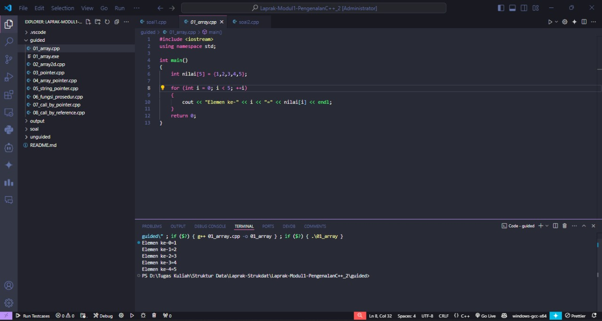

Program ini pakai array nilai[5] buat nyimpan 5 angka. Terus pake loop for buat nampilin tiap elemen dengan indeksnya. Jadi hasilnya nunjukin isi array dari index 0 sampai 4. Intinya biar paham cara simpen dan akses data di array satu dimensi.

### soal 2 Array 2D

```C++
#include <iostream>
using namespace std;

int main() {
    int matrix[3][3] = {
        {1,2,3},
        {4,5,6},
        {7,8,9}
    };
    
    for (int i = 0; i < 3; ++i){
        for (int j = 0; j < 3; ++j){
            cout << matrix[i][j] << " ";
        }
        cout << endl;
    }
    return 0;
}
```
> 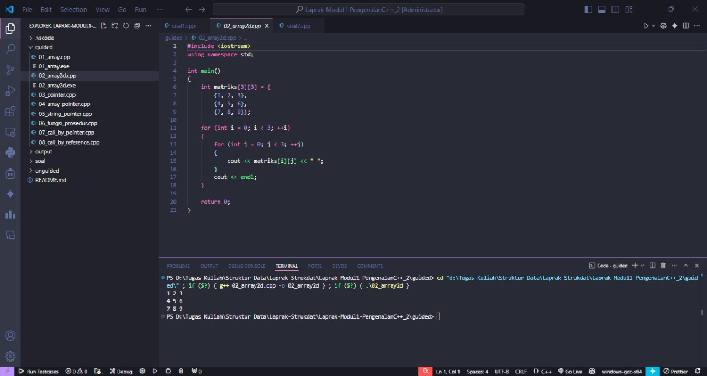

Kode ini bikin matriks 3x3 dan nampilin semua elemennya pake dua loop for. Tiap baris dipisah biar tampil kayak bentuk kotak. Tujuannya biar ngerti cara kerja array dua dimensi dan akses datanya.

### soal 3 Pointer

```C++

#include <iostream>
using namespace std;

int main() {
    int umur = 25;
    int *p_umur;
    
    p_umur = &umur;
    
    cout << "Nilai 'umur': " << umur << endl;
    cout << "Alamat memori 'umur': " << &umur << endl;
    cout << "Nilai 'p_umur' (alamat):" << p_umur << endl;
    cout << "Nilai yang diakses 'p_umur': " << *p_umur << endl;
    cout << "Alamat memori dari pointer 'p_umur' itu sendiri: " << &p_umur << endl;
    
    return 0;
}
```
> 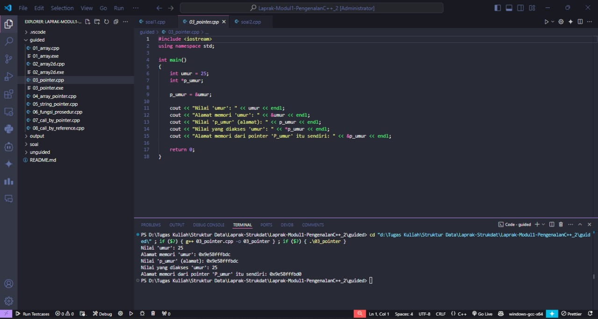

Program ini ngenalin pointer. Variabel umur disimpan di memori, lalu p_umur nyimpen alamatnya. *p_umur dipakai buat akses nilai dari alamat itu. Jadi bisa liat bedanya antara nilai, alamat, dan pointer-nya sendiri.

### soal 4 Array Pointer

```C++

#include <iostream>
using namespace std;

int main(){
    int data[5] = {10,20,30,40,50};
    int *p_data = data;

    cout << "Mengakses elemen array cara normal: " << endl;

    for (int i = 0; i < 5; ++i){
        cout << "Nilai elemen ke-" << i << ": " << data[i] << endl;
    }

    cout << "Mengakses elemen array menggunakan pointer: " << endl;

    for (int i = 0; i < 5; ++i){
        cout << "Nilai elemen ke-" << i << ": " << *(p_data + i) << endl;
    }

    return 0;
}
```
> 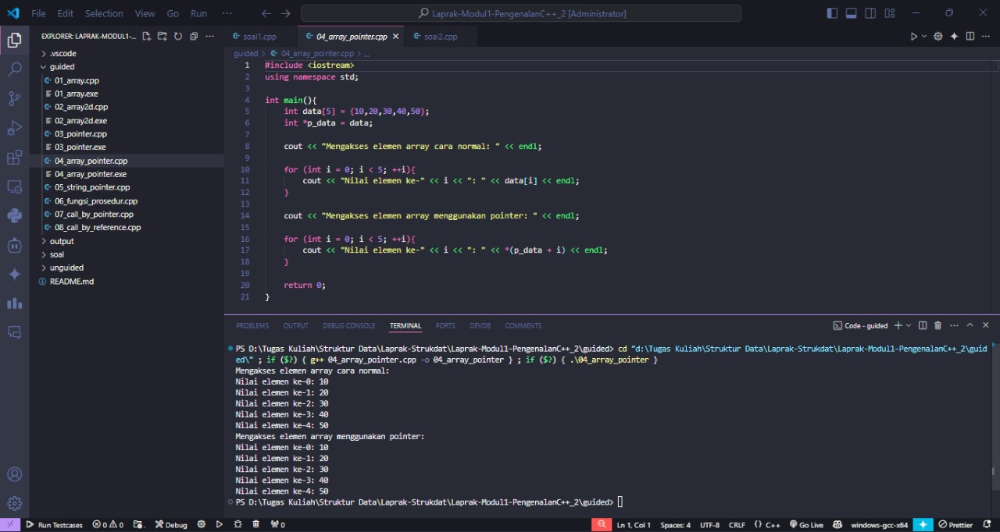

Kode ini nunjukin dua cara akses array: langsung (data[i]) dan lewat pointer (*(p_data + i)). Dua-duanya hasilnya sama. Bedanya, yang pakai pointer aksesnya lewat alamat memori. Intinya biar ngerti cara navigasi array pake pointer.

### soal 5 String Pointer

```C++
#include <iostream>
using namespace std;

int main() {
    char pesan_array[] = "Nasi Padang";
    char *pesan_pointer = "Ayam Bakar 23";

    cout << "String Array: " << pesan_array << endl;
    cout << "String Pointer: " << pesan_pointer << endl;

    // Mengubah karakter dalam array diperbolehkan
    pesan_array[0] = 'h';
    cout << "String Array setelah diubah: " << pesan_array << endl;

    // Pointer dapat diubah untuk menunjuk ke string lain
    pesan_pointer = "Sariman";
    cout << "String Pointer setelah menunjuk ke string lain: " << pesan_pointer << endl;

    return 0;
}
```
> 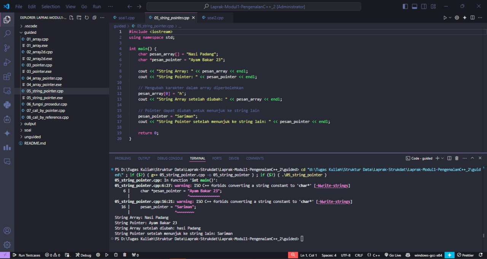

Program ini ngebandingin string array dan string pointer. String array bisa diubah karakternya, tapi string pointer cuma bisa dipindah ke teks lain. Di sini string “Nasi Padang” diubah huruf awalnya, sedangkan pointer-nya diarahkan ke “Sariman”. Tujuannya biar tahu bedanya penyimpanan string di memori.

### soal 6 Function

```C++
#include <iostream>
using namespace std;

int tambah(int a, int b)
{
    return a + b;
}

void tampilkanHasil(int a, int b, int hasil) {
    cout << "Hasil penjumlahan " << a << " + " << b << " adalah: " << hasil << endl;
}

int main() {
    int angka1 = 10;
    int angka2 = 5;

    int hasilJumlah = tambah(angka1, angka2);

    tampilkanHasil(angka1, angka2, hasilJumlah);

    return 0;
}
```
> 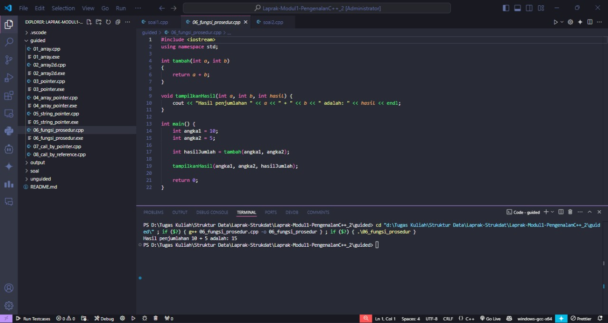

Ada dua fungsi: satu buat nambahin dua angka (tambah) dan satu lagi buat nampilin hasilnya (tampilkanHasil). Di main(), hasil penjumlahan dikirim ke fungsi tampil. Ini contoh dasar cara kerja fungsi dan passing data antar fungsi.

### soal 7 Call By Pointer

```C++
#include <iostream>
using namespace std;

void tukar(int *px, int *py)
{
    int temp = *px;
    *px = *py;
    *py = temp;
}

int main()
{
    int a = 10, b = 20;
    cout << "Sebelum ditukar: a = " << a << ", b = " << b << endl;
    tukar(&a, &b);
    cout << "Setelah ditukar: a = " << a << ", b = " << b << endl;
    return 0;
}
```
> 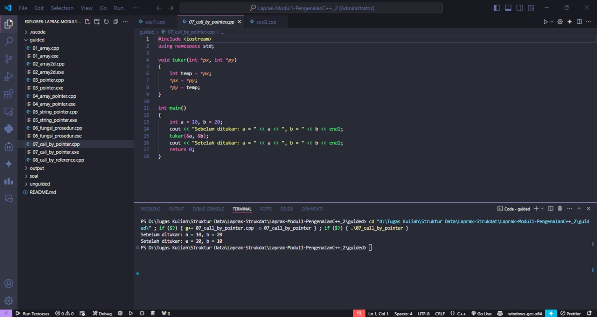

Fungsi tukar() pakai pointer buat tukar nilai dua variabel. Alamat variabel dikirim ke fungsi, terus nilainya ditukar lewat *px dan *py. Hasilnya nilai di variabel asli ikut berubah. Ini contoh “call by pointer”.

### soal 8 Call By Reference

```C++
#include <iostream>
using namespace std;

void tukar(int &x, int &y)
{
    int temp = x;
    x = y;
    y = temp;
}

int main()
{
    int a = 10, b = 20;
    cout << "Sebelum ditukar: a = " << a << ", b = " << b << endl;
    tukar(a, b);
    cout << "Setelah ditukar: a = " << a << ", b = " << b << endl;
    return 0;
}
```
> 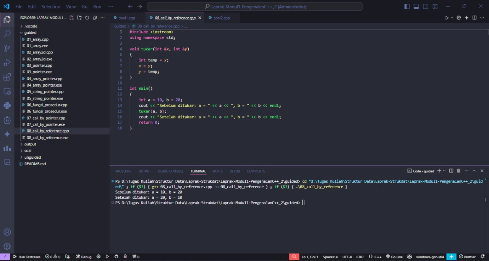

Fungsinya hampir sama kayak soal 7, tapi kali ini pakai referensi (&) bukan pointer. Jadi variabel langsung diubah tanpa kirim alamat. Simpel tapi efeknya sama, nilai aslinya ketukar.

## Unguided

### Soal 1

Buatlah sebuah program untuk melakukan transpose pada sebuah matriks persegi berukuran 3x3. Operasi transpose adalah mengubah baris menjadi kolom dan sebaliknya. Inisialisasi matriks awal di dalam kode, kemudian buat logika untuk melakukan transpose dan simpan hasilnya ke dalam matriks baru. Terakhir, tampilkan matriks awal dan matriks hasil transpose.

> 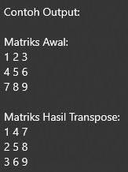

```C++
#include <iostream>
using namespace std;

int main() {
    int n = 3;
    int matriks[3][3] = {
        {1, 2, 3},
        {4, 5, 6},
        {7, 8, 9}
    };
    
    cout << "Matriks Awal:" << endl;
    for(int i = 0; i < n; i++) {
        for(int j = 0; j < n; j++) {
            cout << matriks[i][j] << " ";
        }
        cout << endl;
    }
    
    for(int i = 0; i < n; i++) {
        for(int j = i + 1; j < n; j++) {
            swap(matriks[i][j], matriks[j][i]);
        }
    }
    
    cout << "\nMatriks Hasil Transpose:" << endl;
    for(int i = 0; i < n; i++) {
        for(int j = 0; j < n; j++) {
            cout << matriks[i][j] << " ";
        }
        cout << endl;
    }
    
    return 0;
}
```

> Output
> 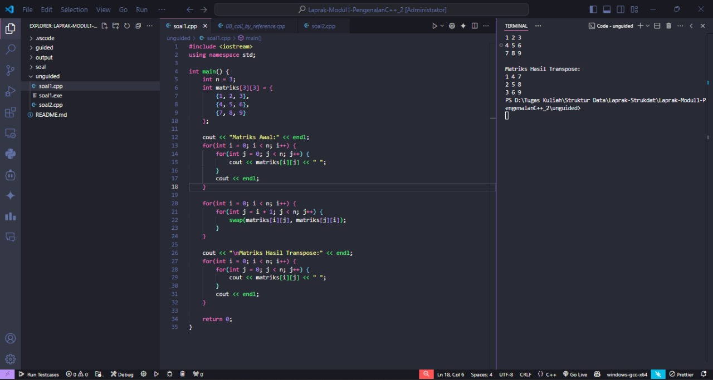

Program ini bikin matriks 3x3, terus ditranspose dengan cara tukar baris dan kolomnya. Tukarnya cuma bagian atas diagonal biar gak dobel. Hasilnya matriksnya kebalik posisi baris dan kolom. Tujuannya biar ngerti operasi transpose di array 2D.

### Soal 2

Buatlah program yang menunjukkan penggunaan call by reference. Buat sebuah prosedur bernama kuadratkan yang menerima satu parameter integer secara referensi (&). Prosedur ini akan mengubah nilai asli variabel yang dilewatkan dengan nilai kuadratnya. Tampilkan nilai variabel di main() sebelum dan sesudah memanggil prosedur untuk membuktikan perubahannya.

> 

```C++
#include <iostream>
using namespace std;

void kuadratkan(int &angka) {
    angka = angka * angka;
}

int main() {
    int nilai;
    
    cout << "Masukkan nilai: ";
    cin >> nilai;
    cout << "Nilai awal: " << nilai << endl;
    kuadratkan(nilai);
    cout << "Nilai setelah dikuadratkan: " << nilai << endl;
    
    return 0;
}
```

> Output
> 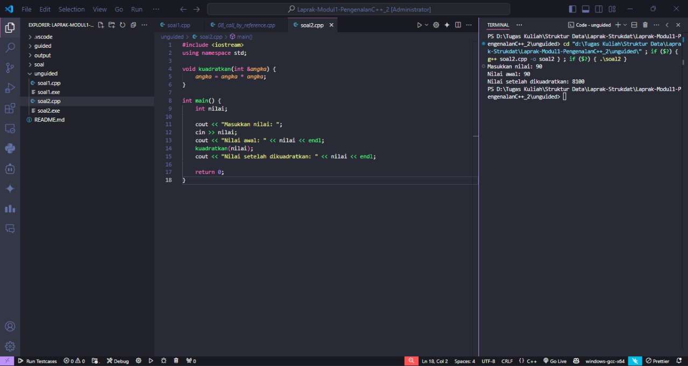

Program ini nunjukin efek call by reference. Nilai yang dimasukin user langsung diubah di fungsi kuadratkan() jadi nilai kuadratnya. Karena pakai referensi, nilai aslinya ikut berubah tanpa return. Simple tapi jelas efeknya.

## Referensi
1. Sui, Y., & Xue, J. (2018). Value-flow-based demand-driven pointer analysis for C and C++. IEEE Transactions on Software Engineering, 46(8), 812-835.
2. Kumar, A. N. (2001, June). Learning the Interaction between Pointers and Scope in C++. In Proceedings of the 6th annual conference on Innovation and technology in computer science education (pp. 45-48).
3. Biliris, A., Dar, S., & Gehani, N. H. (1993). Making C++ objects persistent: The hidden pointers. Software: Practice and Experience, 23(12), 1285-1303.
