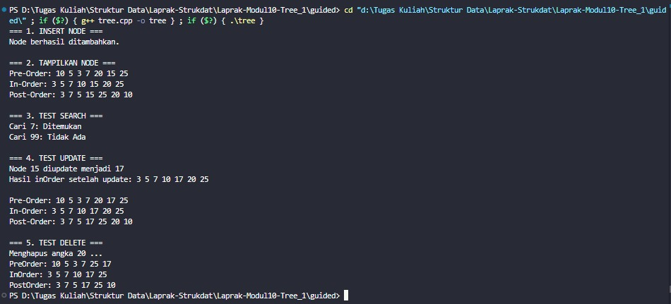
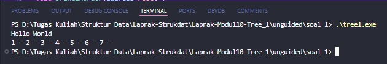
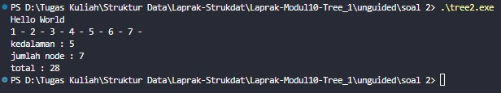
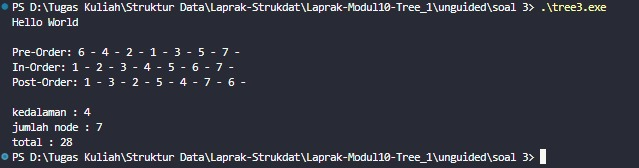

# <h1 align="center">Laporan Praktikum Modul 10<br>Tree</h1>
<p align="center">Arkaan Wisnu Pratama - 103112430118</p>

## Dasar Teori

Tree adalah struktur data hierarkis yang tersusun dari elemen-elemen yang disebut node, di mana setiap node dapat memiliki anak (child) dan biasanya satu induk (parent), kecuali node paling atas yang disebut root. Tree digunakan untuk merepresentasikan hubungan bertingkat, seperti struktur folder, silsilah keluarga, atau organisasi data pada algoritma pencarian. Setiap node dapat memiliki subtree, yaitu tree kecil yang berada di bawahnya. Tree juga memiliki istilah penting seperti leaf (node tanpa anak), depth (kedalaman suatu node dari root), dan height (tinggi tree dari node terdalam). Dalam pemrograman, Tree banyak digunakan karena kemampuannya menyimpan data secara terstruktur sehingga proses pencarian, penyisipan, dan penghapusan data dapat dilakukan lebih cepat dibandingkan struktur linear biasa.

## Guided

### Tree

```C++
#include <iostream>
using namespace std;

struct Node {
    int data;
    Node *kiri, *kanan;
}; 

Node *buatNode(int nilai) {
    Node *baru = new Node;
    baru->data = nilai;
    baru->kiri = baru->kanan = NULL;
    return baru;
}

Node *insert(Node *root, int nilai) {
    if (root == NULL) {
        return buatNode(nilai);
    }
    if (nilai < root->data) {
        root->kiri = insert(root->kiri, nilai);
    } else {
        root->kanan = insert(root->kanan, nilai);
    }
    return root;
}

Node *search(Node *root, int nilai) {
    if (root == NULL || root->data == nilai) {
        return root;
    }
    if (nilai < root->data) {
        return search(root->kiri, nilai);
    }
    return search(root->kanan, nilai);
}

Node *nilaiTerkecil(Node *node) {
    Node *current = node;
    while (current && current->kiri != NULL) {
        current = current->kiri;
    }
    return current;
}

Node *hapus(Node *root, int nilai) {
    if (root == NULL) {
        return root;
    }
    if (nilai < root->data) {
        root->kiri = hapus(root->kiri, nilai);
    } else if (nilai > root->data) {
        root->kanan = hapus(root->kanan, nilai);
    } else {
        if (root->kiri == NULL) {
            Node *temp = root->kanan;
            delete root;
            return temp;
        } else if (root->kanan == NULL) {
            Node *temp = root->kiri;
            delete root;
            return temp;
        }
        Node *temp = nilaiTerkecil(root->kanan);
        root->data = temp->data;
        root->kanan = hapus(root->kanan, temp->data);
    }
    return root;
}

Node *update(Node *root, int lama, int baru) {
    if (search(root, lama) != NULL) { 
        root = hapus(root, lama);
        root = insert(root, baru);
        cout << "Node " << lama << " diupdate menjadi " << baru << endl;
    }
    else {
        cout << "Node " << lama << " tidak ditemukan." << endl;
    }
    return root;
}

void preOrder(Node *root) {  
    if (root != NULL) {
        cout << root->data << " ";
        preOrder(root->kiri);
        preOrder(root->kanan);
    }
}

void inOrder(Node *root) { 
    if (root != NULL) {
        inOrder(root->kiri);
        cout << root->data << " ";
        inOrder(root->kanan);
    }
}

void postOrder(Node *root) {  
    if (root != NULL) {
        postOrder(root->kiri);
        postOrder(root->kanan);
        cout << root->data << " ";
    }
}

int main() {  
    Node *root = NULL;
    cout << "=== 1. INSERT NODE ===" << endl;
    root = insert(root, 10);
    root = insert(root, 5);      
    root = insert(root, 20);  
    root = insert(root, 3);      
    root = insert(root, 7);   
    root = insert(root, 15);     
    root = insert(root, 25);    
    cout << "Node berhasil ditambahkan." << endl;

    cout << "\n=== 2. TAMPILKAN NODE ===" << endl;
    cout << "Pre-Order: ";
    preOrder(root);
    cout << endl;

    cout << "In-Order: ";
    inOrder(root);
    cout << endl;

    cout << "Post-Order: ";
    postOrder(root);
    cout << endl;

    cout << "\n=== 3. TEST SEARCH ===" << endl;
    int cari1 = 7, cari2 = 99;
    cout << "Cari " << cari1 << ": " << (search(root, cari1) ? "Ditemukan" : "Tidak Ada") << endl;  
    cout << "Cari " << cari2 << ": " << (search(root, cari2) ? "Ditemukan" : "Tidak Ada") << endl;  
    
    cout << "\n=== 4. TEST UPDATE ===" << endl;
    root = update(root, 15, 17);
    cout << "Hasil inOrder setelah update: ";  
    inOrder(root);
    cout << endl;

    cout << "\nPre-Order: ";
    preOrder(root);
    cout << endl;
    cout << "In-Order: ";
    inOrder(root);
    cout << endl;
    cout << "Post-Order: ";
    postOrder(root);
    cout << endl;
    
    cout << "\n=== 5. TEST DELETE ===" << endl;
    cout << "Menghapus angka 20 ..." << endl;
    root = hapus(root, 20); 

    cout << "PreOrder: ";
    preOrder(root);
    cout << endl;
    cout << "InOrder: ";
    inOrder(root);
    cout << endl;   
    cout << "PostOrder: ";
    postOrder(root);
    cout << endl;
    
    return 0;

}
```
Kode di atas adalah implementasi sederhana dari Binary Search Tree (BST) dengan fitur insert, search, update, dan delete. Setiap node punya data serta pointer kiri dan kanan, lalu insert menaruh nilai sesuai aturan BST, search buat nyari nilai, dan delete menghapus node termasuk menangani kasus punya satu atau dua anak. Fungsi update basically ngapus nilai lama lalu masukin nilai baru. Traversal preOrder, inOrder, dan postOrder dipakai buat nampilin isi tree sesuai urutannya. Di main, semua fungsi itu dites mulai dari insert beberapa angka, tampilkan tree, search, update node, sampai hapus node.

> 

## Unguided

### Soal Tree 1

```C++
#include "bstree.h"

address alokasi(infotype x) {
    address newNode = new Node;
    newNode->info = x;
    newNode->left = NULL;
    newNode->right = NULL;
    return newNode;
}

void insertNode(address &root, infotype x) {
    if (root == NULL) {
        root = alokasi(x);
    } else {
        if (x < root->info) {
            insertNode(root->left, x);
        } else if (x > root->info) {
            insertNode(root->right, x);
        }
    }
}

void inOrder(address root) {
    if (root != NULL) {
        inOrder(root->left);        
        cout << root->info << " - "; 
        inOrder(root->right);       
    }
}

address findNode(infotype x, address root) {
    if (root == NULL) {
        return NULL;
    } else if (x == root->info) {
        return root;
    } else if (x < root->info) {
        return findNode(x, root->left);
    } else {
        return findNode(x, root->right);
    }
}

void printInOrder(address root) {
    inOrder(root);
    cout << endl;
}
```

```C++
#include <iostream>
#include "bstree.h"

using namespace std;

int main() {
    cout << "Hello World" << endl;
    
    address root = NULL;
    
    insertNode(root, 1);
    insertNode(root, 2);
    insertNode(root, 3);
    insertNode(root, 4);
    insertNode(root, 5);
    insertNode(root, 6);
    insertNode(root, 7);
    
    inOrder(root);
    
    return 0;
}
```

```cpp
#ifndef BSTREE_H
#define BSTREE_H

#include <iostream>
using namespace std;

typedef int infotype;
typedef struct Node* address;

struct Node {
    infotype info;
    address left;
    address right;
};

address alokasi(infotype x);
void insertNode(address &root, infotype x);
void inOrder(address root);
address findNode(infotype x, address root);
void printInOrder(address root);

#endif
```

Kode ini adalah implementasi dasar Binary Search Tree (BST) yang terdiri dari file header, file fungsi, dan file main untuk ngetes programnya. Di header didefinisikan struktur Node serta deklarasi fungsi, lalu di file implementasi ada fungsi alokasi untuk bikin node baru, insertNode untuk masukin data sesuai aturan BST, inOrder untuk traversal, dan findNode buat nyari nilai tertentu. Program utamanya cuma nyoba insert angka 1 sampai 7 lalu nampilin hasilnya pakai traversal in-order. Secara keseluruhan, kode ini nunjukin cara kerja BST yang sederhana dan mudah dipahami.

> 

### Soal Tree 2

```C++
#include "bstree.h"

address alokasi(infotype x) {
    address newNode = new Node;
    newNode->info = x;
    newNode->left = NULL;
    newNode->right = NULL;
    return newNode;
}

void insertNode(address &root, infotype x) {
    if (root == NULL) {
        root = alokasi(x);
    } else {
        if (x < root->info) {
            insertNode(root->left, x);
        } else if (x > root->info) {
            insertNode(root->right, x);
        }
    }
}

void inOrder(address root) {
    if (root != NULL) {
        inOrder(root->left);        
        cout << root->info << " - "; 
        inOrder(root->right);       
    }
}

address findNode(infotype x, address root) {
    if (root == NULL) {
        return NULL;
    } else if (x == root->info) {
        return root;
    } else if (x < root->info) {
        return findNode(x, root->left);
    } else {
        return findNode(x, root->right);
    }
}

void printInOrder(address root) {
    inOrder(root);
    cout << endl;
}
int hitungJumlahNode(address root) {
    if (root == NULL) {
        return 0;
    } else {
        return 1 + hitungJumlahNode(root->left) + hitungJumlahNode(root->right);
    }
}

int hitungTotalInfo(address root, int start) {
    if (root == NULL) {
        return start;
    } else {
        start = start + root->info;
        start = hitungTotalInfo(root->left, start);
        start = hitungTotalInfo(root->right, start);
        return start;
    }
}

int hitungKedalaman(address root, int start) {
    if (root == NULL) {
        return start;
    } else {
        int kedalamanKiri = hitungKedalaman(root->left, start + 1);
        int kedalamanKanan = hitungKedalaman(root->right, start + 1);
        
        if (kedalamanKiri > kedalamanKanan) {
            return kedalamanKiri;
        } else {
            return kedalamanKanan;
        }
    }
}
```

```C++
#include <iostream>
#include "bstree.h"

using namespace std;

int main() {
    cout << "Hello World" << endl;
    address root = NULL;
    
    insertNode(root, 1);
    insertNode(root, 2);
    insertNode(root, 6);
    insertNode(root, 4);
    insertNode(root, 5);
    insertNode(root, 3);
    insertNode(root, 6);
    insertNode(root, 7);
    
    inOrder(root);
    cout << endl;
    
    cout << "kedalaman : " << hitungKedalaman(root, 0) << endl;
    cout << "jumlah node : " << hitungJumlahNode(root) << endl;    
    cout << "total : " << hitungTotalInfo(root, 0) << endl;
    return 0;
}
```

```cpp
#ifndef BSTREE_H
#define BSTREE_H

#include <iostream>
using namespace std;

typedef int infotype;
typedef struct Node* address;

struct Node {
    infotype info;
    address left;
    address right;
};

address alokasi(infotype x);
void insertNode(address &root, infotype x);
void inOrder(address root);
address findNode(infotype x, address root);
void printInOrder(address root);

int hitungJumlahNode(address root);
int hitungTotalInfo(address root, int start);
int hitungKedalaman(address root, int start);

#endif
```

Kode ini adalah implementasi Binary Search Tree (BST) yang lengkap dengan fungsi insert, traversal, pencarian, serta beberapa operasi tambahan seperti hitung jumlah node, total nilai, dan kedalaman tree. Di file header didefinisikan struktur Node dan semua prototype fungsi, sedangkan di file implementasinya ada fungsi alokasi node baru, insertNode untuk masukin data ke BST, inOrder buat nampilin isi tree, dan findNode untuk nyari nilai tertentu. Ada juga fungsi hitungJumlahNode buat ngitung total node, hitungTotalInfo buat ngejumlahin semua nilai info, dan hitungKedalaman untuk ngecek seberapa dalam pohonnya. Program di main kemudian nyoba masukin beberapa angka, nampilin hasil in-order, lalu ngeprint kedalaman tree, jumlah node, dan total nilai. Secara keseluruhan, kode ini nunjukin cara kerja BST yang simple tapi cukup lengkap untuk kebutuhan dasar.

> 

### Soal Tree 3

```C++
#include "bstree.h"

address alokasi(infotype x) {
    address newNode = new Node;
    newNode->info = x;
    newNode->left = NULL;
    newNode->right = NULL;
    return newNode;
}

void insertNode(address &root, infotype x) {
    if (root == NULL) {
        root = alokasi(x);
    } else {
        if (x < root->info) {
            insertNode(root->left, x);
        } else if (x > root->info) {
            insertNode(root->right, x);
        }
    }
}

void inOrder(address root) {
    if (root != NULL) {
        inOrder(root->left);        
        cout << root->info << " - "; 
        inOrder(root->right);       
    }
}

address findNode(infotype x, address root) {
    if (root == NULL) {
        return NULL;
    } else if (x == root->info) {
        return root;
    } else if (x < root->info) {
        return findNode(x, root->left);
    } else {
        return findNode(x, root->right);
    }
}

void printInOrder(address root) {
    inOrder(root);
    cout << endl;
}
int hitungJumlahNode(address root) {
    if (root == NULL) {
        return 0;
    } else {
        return 1 + hitungJumlahNode(root->left) + hitungJumlahNode(root->right);
    }
}

int hitungTotalInfo(address root, int start) {
    if (root == NULL) {
        return start;
    } else {
        start = start + root->info;
        start = hitungTotalInfo(root->left, start);
        start = hitungTotalInfo(root->right, start);
        return start;
    }
}

int hitungKedalaman(address root, int start) {
    if (root == NULL) {
        return start;
    } else {
        int kedalamanKiri = hitungKedalaman(root->left, start + 1);
        int kedalamanKanan = hitungKedalaman(root->right, start + 1);
        
        if (kedalamanKiri > kedalamanKanan) {
            return kedalamanKiri;
        } else {
            return kedalamanKanan;
        }
    }
}

void preOrder(address root) {
    if (root != NULL) {
        cout << root->info << " - "; 
        preOrder(root->left);        
        preOrder(root->right);       
    }
}

void postOrder(address root) {
    if (root != NULL) {
        postOrder(root->left);       
        postOrder(root->right);      
        cout << root->info << " - "; 
    }
}

void printPreOrder(address root) {
    preOrder(root);
    cout << endl;
}
void printPostOrder(address root) {
    postOrder(root);
    cout << endl;
}
```

```C++
#include <iostream>
#include "bstree.h"

using namespace std;

int main() {
    cout << "Hello World" << endl;
    
    address root = NULL;
    
    insertNode(root, 6);
    insertNode(root, 4);
    insertNode(root, 7);
    insertNode(root, 2);
    insertNode(root, 5);
    insertNode(root, 1);
    insertNode(root, 3);
    
    cout << "\nPre-Order: ";
    printPreOrder(root);
    
    cout << "In-Order: ";
    printInOrder(root);
    
    cout << "Post-Order: ";
    printPostOrder(root);
    
    cout << "\nkedalaman : " << hitungKedalaman(root, 0) << endl;
    cout << "jumlah node : " << hitungJumlahNode(root) << endl;
    cout << "total : " << hitungTotalInfo(root, 0) << endl;
    
    return 0;
}
```

```cpp
#ifndef BSTREE_H
#define BSTREE_H

#include <iostream>
using namespace std;

typedef int infotype;
typedef struct Node* address;

struct Node {
    infotype info;
    address left;
    address right;
};

address alokasi(infotype x);
void insertNode(address &root, infotype x);
void inOrder(address root);
address findNode(infotype x, address root);
void printInOrder(address root);

int hitungJumlahNode(address root);
int hitungTotalInfo(address root, int start);
int hitungKedalaman(address root, int start);

void preOrder(address root);
void postOrder(address root);
void printPreOrder(address root);
void printPostOrder(address root);

#endif
```

Kode ini adalah implementasi lengkap dari Binary Search Tree (BST) yang punya fitur insert, search, traversal (pre-order, in-order, post-order), dan perhitungan seperti jumlah node, total nilai info, serta kedalaman tree. File header berisi struktur Node dan deklarasi semua fungsi, sementara file implementasi ngurus pembuatan node baru, proses masukin data ke tree sesuai aturan BST, dan berbagai traversal buat nampilin isi tree. Selain itu, ada juga fungsi tambahan seperti hitungJumlahNode buat ngitung total elemen, hitungTotalInfo buat nge-jumlahin semua nilai, dan hitungKedalaman untuk tau seberapa dalam pohonnya. Di file main, program masukin beberapa nilai, terus nampilin tree dalam tiga jenis traversal, lalu ngeluarin kedalaman, jumlah node, dan total nilai. Secara keseluruhan, kode ini nunjukin struktur BST yang lengkap dan mudah dipahami.

> 

## Referensi
1. Wisesty, U. N., Nurrahmi, H., Yunanto, P. E., Rismala, R., & Sthevanie, F. (2025). STRUKTUR DATA MENGGUNAKAN C++. PENERBIT KBM INDONESIA. https://books.google.com/books?hl=en&lr=&id=JwCTEQAAQBAJ&oi=fnd&pg=PA157&dq=tree+bahasa+cpp&ots=Wt5zLl_j_k&sig=NxhKxZJodN_8PxFVplIORN62y78

2. Anita Sindar, R. M. S. (2019). Struktur Data Dan Algoritma Dengan C++ (Vol. 1). CV. AA. RIZKY. https://books.google.com/books?hl=en&lr=&id=GP_ADwAAQBAJ&oi=fnd&pg=PA23&dq=stack+pada+c%2B%2B&ots=86k4Nl2OhV&sig=0KNR8rE2WYaLliEAZmi71x2eU7k

3. Santoso, L. E. (2004). STANDARD TEMPLATE LIBRARY C++ UNTUK MENGAJARKAN STRUKTUR DATA. Jurnal FASILKOM Vol, 2(2). https://www.academia.edu/download/56411324/standard-template-library-c__-untuk-mengajarkan-struktur-data.pdf