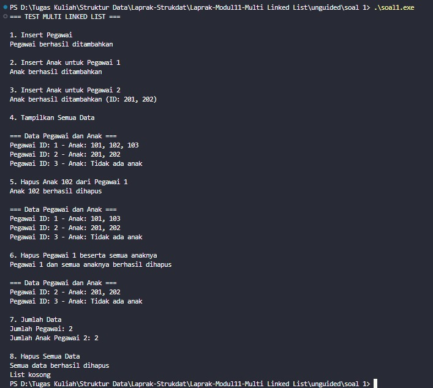
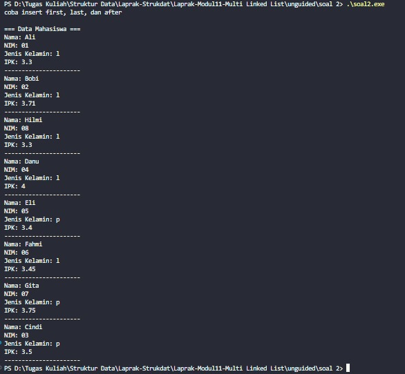

# <h1 align="center"> Laporan Praktikum Modul 11 <br> Multi Linkedlist </h1>
<p align="center">Arkaan Wisnu Pratama - 103112430118</p>

## Dasar Teori

Multi Linked List adalah struktur data lanjutan dari linked list biasa, di mana setiap node bisa punya lebih dari satu pointer untuk menghubungkan data ke arah atau level yang berbeda. Kalau single linked list cuma punya pointer next dan double linked list punya next serta prev, Multi Linked List bisa punya banyak cabang sesuai kebutuhan. Struktur ini biasanya dipakai ketika data tidak cukup direpresentasikan oleh satu hubungan saja. Dengan banyak pointer dalam satu node, hubungan antar data bisa lebih fleksibel dan kompleks. Intinya, Multi Linked List memungkinkan pembuatan struktur yang mirip pohon atau tabel yang bercabang.

Penggunaan Multi Linked List sering muncul pada kasus yang melibatkan data bertingkat, misalnya struktur fakultas → jurusan → kelas → mahasiswa. Setiap level bisa dianggap sebagai linked list sendiri, lalu saling terhubung lewat pointer tambahan. Cara kerja seperti ini bikin traversal data jadi lebih terstruktur karena kita bisa jalan dari satu level ke level lain dengan mudah. Keunggulan utamanya adalah data bisa dipecah ke beberapa list tanpa harus bikin struktur terpisah. Selain itu, Multi Linked List mempermudah pengelompokan data yang sifatnya hierarkis.

Walaupun fleksibel, Multi Linked List juga punya kekurangan, terutama dalam hal kompleksitas pengelolaan pointer. Semakin banyak pointer per node, semakin besar kemungkinan terjadinya error seperti pointer hilang atau tidak sinkron. Proses insert, delete, dan search juga jadi lebih rumit dibanding linked list biasa karena harus mempertimbangkan banyak cabang. Namun struktur ini tetap kuat untuk kasus tertentu yang membutuhkan data saling terhubung dalam banyak arah. Jadi, Multi Linked List cocok dipakai saat struktur data yang dibutuhkan tidak bisa ditangani oleh linked list standar.

## Guided

### soal 1 

```C++
#include <iostream>
#include <string>
using namespace std;

struct ChildNode
{
    string info;
    ChildNode* next;
};

struct ParentNode
{
    string info;
    ParentNode* next;
    ChildNode* childHead;
};

ParentNode *createParent(string info)
{
    ParentNode *newNode = new ParentNode;
    newNode->info = info;
    newNode->childHead = NULL;
    newNode->next = NULL;
    return newNode;
}

ChildNode *createChild(string info)
{
    ChildNode *newNode = new ChildNode;
    newNode->info = info;
    newNode->next = NULL;
    return newNode;
}

void insertParent(ParentNode *&head, string info)
{
    ParentNode *newNode = createParent(info);
    if (head == NULL)
    {
        head = newNode;
    }
    else
    {
        ParentNode *temp = head;
        while (temp->next != NULL)
        {
            temp = temp->next;
        }
        temp->next = newNode;
    }
}

void insertChild(ParentNode *head, string parenInfo, string childInfo)
{
    ParentNode *p = head;
    while (p != NULL && p->info != parenInfo)
    {
        p = p->next;
    }
    if (p != NULL)
    {
        ChildNode *newChild = createChild(childInfo);
        if (p->childHead == NULL)
        {
            p->childHead = newChild;
        }
        else
        {
            ChildNode *c = p->childHead;
            while (c->next != NULL)
            {
                c = c->next;
            }
            c->next = newChild;
        }
    }
}

void printAll(ParentNode *head)
{
    ParentNode *p = head;
    while (p != NULL)
    {
        cout << p ->info;
        ChildNode *c = p->childHead;
        if (c != NULL)
        {
            while (c != NULL)
            {
                cout << " -> " << c->info;
                c = c->next;
            }
        }
        cout << endl;
        p = p->next;
    }
}

int main()
{
    ParentNode *list = NULL;

    insertParent(list, "Parent Node 1");
    insertParent(list, "Parent Node 2");

    printAll(list);
    cout << "\n";
    
    insertChild(list, "Parent Node 1", "Child1.A");
    insertChild(list, "Parent Node 1", "Child1.B");
    insertChild(list, "Parent Node 2", "Child2.C");

    printAll(list);

    return 0;
}

```
> 

Kode ini merupakan implementasi dasar dari Multi Linked List, di mana setiap node parent dapat memiliki list anak (child list) sendiri. Struktur ParentNode menyimpan data parent, pointer ke parent berikutnya, dan pointer ke head dari child list-nya, sedangkan ChildNode menyimpan data anak dan pointer ke node anak berikutnya. Fungsi insertParent digunakan untuk menambah parent baru di akhir list, sementara insertChild menambah child baru ke parent tertentu berdasarkan info yang dicari. Program utama mencoba membuat dua parent, menampilkan isi list, lalu menambahkan beberapa child ke masing-masing parent. Terakhir, fungsi printAll menampilkan seluruh parent beserta seluruh child yang terhubung, sehingga membentuk struktur hierarki sederhana.

## Unguided

### Soal 1

#### multilist.h
```C++
#ifndef MULTILIST_H_INCLUDED
#define MULTILIST_H_INCLUDED
#define Nil NULL

typedef int infotypeanak;
typedef int infotypeinduk;
typedef struct elemen_list_induk *address;
typedef struct elemen_list_anak *address_anak;

struct elemen_list_anak {
    infotypeanak info;
    address_anak next;
    address_anak prev;
};

struct listanak {
    address_anak first;
    address_anak last;
};

struct elemen_list_induk {
    infotypeinduk info;
    listanak lanak;
    address next;
    address prev;
};

struct listinduk {
    address first;
    address last;
};

bool ListEmpty(listinduk L);
bool ListEmptyAnak(listanak L);

void CreateList(listinduk &L);
void CreateListAnak(listanak &L);


address alokasi(infotypeinduk X);
address_anak alokasiAnak(infotypeanak X);
void dealokasi(address &P);
void dealokasiAnak(address_anak &P);

address findElm(listinduk L, infotypeinduk X);
address_anak findElmAnak(listanak Lanak, infotypeanak X);

void insertFirst(listinduk &L, address P);
void insertLast(listinduk &L, address P);

void insertFirstAnak(listanak &L, address_anak P);
void insertLastAnak(listanak &L, address_anak P);

void delFirst(listinduk &L, address &P);
void delLast(listinduk &L, address &P);
void delP(listinduk &L, infotypeinduk X);

void delFirstAnak(listanak &L, address_anak &P);
void delLastAnak(listanak &L, address_anak &P);
void delPAnak(listanak &L, infotypeanak X);

void printInfo(listinduk L);
void printInfoAnak(listanak Lanak);
int nbList(listinduk L);
int nbListAnak(listanak Lanak);
void delAll(listinduk &L);

#endif
```

#### multilist.cpp
```C++
#include "multilist.h"
#include <iostream>
using namespace std;

bool ListEmpty(listinduk L) {
    return L.first == Nil;
}

bool ListEmptyAnak(listanak L) {
    return L.first == Nil;
}

void CreateList(listinduk &L) {
    L.first = Nil;
    L.last = Nil;
}

void CreateListAnak(listanak &L) {
    L.first = Nil;
    L.last = Nil;
}

address alokasi(infotypeinduk X) {
    address P = new elemen_list_induk;
    if (P != Nil) {
        P->info = X;
        CreateListAnak(P->lanak);
        P->next = Nil;
        P->prev = Nil;
    }
    return P;
}

address_anak alokasiAnak(infotypeanak X) {
    address_anak P = new elemen_list_anak;
    if (P != Nil) {
        P->info = X;
        P->next = Nil;
        P->prev = Nil;
    }
    return P;
}

void dealokasi(address &P) {
    delete P;
    P = Nil;
}

void dealokasiAnak(address_anak &P) {
    delete P;
    P = Nil;
}

address findElm(listinduk L, infotypeinduk X) {
    address P = L.first;
    while (P != Nil) {
        if (P->info == X) {
            return P;
        }
        P = P->next;
    }
    return Nil;
}

address_anak findElmAnak(listanak Lanak, infotypeanak X) {
    address_anak P = Lanak.first;
    while (P != Nil) {
        if (P->info == X) {
            return P;
        }
        P = P->next;
    }
    return Nil;
}

void insertFirst(listinduk &L, address P) {
    if (ListEmpty(L)) {
        L.first = P;
        L.last = P;
    } else {
        P->next = L.first;
        L.first->prev = P;
        L.first = P;
    }
}

void insertLast(listinduk &L, address P) {
    if (ListEmpty(L)) {
        L.first = P;
        L.last = P;
    } else {
        L.last->next = P;
        P->prev = L.last;
        L.last = P;
    }
}

void insertFirstAnak(listanak &L, address_anak P) {
    if (ListEmptyAnak(L)) {
        L.first = P;
        L.last = P;
    } else {
        P->next = L.first;
        L.first->prev = P;
        L.first = P;
    }
}

void insertLastAnak(listanak &L, address_anak P) {
    if (ListEmptyAnak(L)) {
        L.first = P;
        L.last = P;
    } else {
        L.last->next = P;
        P->prev = L.last;
        L.last = P;
    }
}

void delFirst(listinduk &L, address &P) {
    if (!ListEmpty(L)) {
        P = L.first;
        if (L.first == L.last) {
            L.first = Nil;
            L.last = Nil;
        } else {
            L.first = L.first->next;
            L.first->prev = Nil;
            P->next = Nil;
        }
    }
}

void delLast(listinduk &L, address &P) {
    if (!ListEmpty(L)) {
        P = L.last;
        if (L.first == L.last) {
            L.first = Nil;
            L.last = Nil;
        } else {
            L.last = L.last->prev;
            L.last->next = Nil;
            P->prev = Nil;
        }
    }
}

void delP(listinduk &L, infotypeinduk X) {
    address P = findElm(L, X);
    if (P != Nil) {
        address_anak PA;
        while (!ListEmptyAnak(P->lanak)) {
            delFirstAnak(P->lanak, PA);
            dealokasiAnak(PA);
        }
    
        if (P == L.first) {
            delFirst(L, P);
        } else if (P == L.last) {
            delLast(L, P);
        } else {
            P->prev->next = P->next;
            P->next->prev = P->prev;
        }
        dealokasi(P);
    }
}

void delFirstAnak(listanak &L, address_anak &P) {
    if (!ListEmptyAnak(L)) {
        P = L.first;
        if (L.first == L.last) {
            L.first = Nil;
            L.last = Nil;
        } else {
            L.first = L.first->next;
            L.first->prev = Nil;
            P->next = Nil;
        }
    }
}

void delLastAnak(listanak &L, address_anak &P) {
    if (!ListEmptyAnak(L)) {
        P = L.last;
        if (L.first == L.last) {
            L.first = Nil;
            L.last = Nil;
        } else {
            L.last = L.last->prev;
            L.last->next = Nil;
            P->prev = Nil;
        }
    }
}

void delPAnak(listanak &L, infotypeanak X) {
    address_anak P = findElmAnak(L, X);
    if (P != Nil) {
        if (P == L.first) {
            delFirstAnak(L, P);
        } else if (P == L.last) {
            delLastAnak(L, P);
        } else {
            P->prev->next = P->next;
            P->next->prev = P->prev;
        }
        dealokasiAnak(P);
    }
}

void printInfoAnak(listanak Lanak) {
    if (ListEmptyAnak(Lanak)) {
        cout << "Tidak ada anak";
    } else {
        address_anak P = Lanak.first;
        while (P != Nil) {
            cout << P->info;
            if (P->next != Nil) cout << ", ";
            P = P->next;
        }
    }
}

void printInfo(listinduk L) {
    if (ListEmpty(L)) {
        cout << "List kosong" << endl;
    } else {
        address P = L.first;
        cout << "\n=== Data Pegawai dan Anak ===" << endl;
        while (P != Nil) {
            cout << "Pegawai ID: " << P->info << " - Anak: ";
            printInfoAnak(P->lanak);
            cout << endl;
            P = P->next;
        }
    }
}

int nbList(listinduk L) {
    int count = 0;
    address P = L.first;
    while (P != Nil) {
        count++;
        P = P->next;
    }
    return count;
}

int nbListAnak(listanak Lanak) {
    int count = 0;
    address_anak P = Lanak.first;
    while (P != Nil) {
        count++;
        P = P->next;
    }
    return count;
}

void delAll(listinduk &L) {
    address P;
    while (!ListEmpty(L)) {
        delFirst(L, P);
        address_anak PA;
        while (!ListEmptyAnak(P->lanak)) {
            delFirstAnak(P->lanak, PA);
            dealokasiAnak(PA);
        }
        dealokasi(P);
    }
}
```

#### main.cpp
```C++
#include "multilist.h"
#include <iostream>
using namespace std;

int main() {
    listinduk L;
    address P;
    address_anak PA;
    
    CreateList(L);
    
    cout << "=== TEST MULTI LINKED LIST ===" << endl;
    
    cout << "\n1. Insert Pegawai" << endl;
    P = alokasi(1);
    insertLast(L, P);
    
    P = alokasi(2);
    insertLast(L, P);
    
    P = alokasi(3);
    insertLast(L, P);
    
    cout << "Pegawai berhasil ditambahkan" << endl;
    
    cout << "\n2. Insert Anak untuk Pegawai 1" << endl;
    P = findElm(L, 1);
    if (P != Nil) {
        PA = alokasiAnak(101);
        insertLastAnak(P->lanak, PA);
        
        PA = alokasiAnak(102);
        insertLastAnak(P->lanak, PA);
        
        PA = alokasiAnak(103);
        insertLastAnak(P->lanak, PA);
        
        cout << "Anak berhasil ditambahkan" << endl;
    }
    
    cout << "\n3. Insert Anak untuk Pegawai 2" << endl;
    P = findElm(L, 2);
    if (P != Nil) {
        PA = alokasiAnak(201);
        insertLastAnak(P->lanak, PA);
        
        PA = alokasiAnak(202);
        insertLastAnak(P->lanak, PA);
        
        cout << "Anak berhasil ditambahkan (ID: 201, 202)" << endl;
    }
    
    cout << "\n4. Tampilkan Semua Data" << endl;
    printInfo(L);
    
    cout << "\n5. Hapus Anak 102 dari Pegawai 1" << endl;
    P = findElm(L, 1);
    if (P != Nil) {
        delPAnak(P->lanak, 102);
        cout << "Anak 102 berhasil dihapus" << endl;
    }
    
    printInfo(L);
    
    cout << "\n6. Hapus Pegawai 1 beserta semua anaknya" << endl;
    delP(L, 1);
    cout << "Pegawai 1 dan semua anaknya berhasil dihapus" << endl;
    
    printInfo(L);
    
    cout << "\n7. Jumlah Data" << endl;
    cout << "Jumlah Pegawai: " << nbList(L) << endl;
    
    P = findElm(L, 2);
    if (P != Nil) {
        cout << "Jumlah Anak Pegawai 2: " << nbListAnak(P->lanak) << endl;
    }
    
    cout << "\n8. Hapus Semua Data" << endl;
    delAll(L);
    cout << "Semua data berhasil dihapus" << endl;
    
    printInfo(L);
    
    return 0;
}
```

> Output
> 

Multi Linked List adalah struktur data yang bikin kita bisa nyimpen data yang punya hubungan dua level, misalnya pegawai yang punya anak data sendiri di dalamnya. Jadi setiap node induk bukan cuma simpen info pegawai, tapi juga punya list anak yang isinya data turunan terkait pegawai itu. Dengan model ini, kita bisa masukin, hapus, atau nyari data pegawai sekaligus ngatur data anak-anaknya tanpa harus bikin struktur terpisah. Prosesnya mirip kayak gabungan double linked list untuk induk dan double linked list lagi buat anak, tapi semuanya terhubung rapi. Intinya, Multi Linked List dipakai kalau kamu butuh data yang berhubungan secara hierarki dan tetap gampang diakses.

### Soal 2

#### multilist.h
```C++
#ifndef CIRCULARLIST_H
#define CIRCULARLIST_H

#include <iostream>
#include <string>
using namespace std;

#define Nil NULL

struct mahasiswa {
    string nama;
    string nim;
    char jenis_kelamin;
    float ipk;
};

typedef mahasiswa infotype;
typedef struct ElmList* address;

struct ElmList {
    infotype info;
    address next;
};

struct List {
    address first;
};

void createList(List &L);
address alokasi(infotype x);
void dealokasi(address &P);
void insertFirst(List &L, address P);
void insertAfter(List &L, address Prec, address P);
void insertLast(List &L, address P);
void deleteFirst(List &L, address &P);
void deleteAfter(List &L, address Prec, address &P);
void deleteLast(List &L, address &P);
address findElm(List L, infotype x);
void printInfo(List L);

#endif
```

#### multilist.cpp
```C++
#include "circularlist.h"

void createList(List &L) {
    L.first = Nil;
}

address alokasi(infotype x) {
    address P = new ElmList;
    if (P != Nil) {
        P->info = x;
        P->next = Nil;
    }
    return P;
}

void dealokasi(address &P) {
    delete P;
    P = Nil;
}

void insertFirst(List &L, address P) {
    if (L.first == Nil) {
        L.first = P;
        P->next = P;
    } else {
        address last = L.first;
        while (last->next != L.first) {
            last = last->next;
        }
        P->next = L.first;
        last->next = P;
        L.first = P;
    }
}

void insertAfter(List &L, address Prec, address P) {
    if (Prec != Nil) {
        P->next = Prec->next;
        Prec->next = P;
    }
}

void insertLast(List &L, address P) {
    if (L.first == Nil) {
        L.first = P;
        P->next = P;
    } else {
        address last = L.first;
        while (last->next != L.first) {
            last = last->next;
        }
        last->next = P;
        P->next = L.first;
    }
}

void deleteFirst(List &L, address &P) {
    if (L.first != Nil) {
        P = L.first;
        if (L.first->next == L.first) {
            L.first = Nil;
        } else {
            address last = L.first;
            while (last->next != L.first) {
                last = last->next;
            }
            L.first = L.first->next;
            last->next = L.first;
        }
        P->next = Nil;
    }
}

void deleteAfter(List &L, address Prec, address &P) {
    if (Prec != Nil && Prec->next != Nil) {
        P = Prec->next;
        Prec->next = P->next;
        P->next = Nil;
    }
}

void deleteLast(List &L, address &P) {
    if (L.first != Nil) {
        if (L.first->next == L.first) {
            P = L.first;
            L.first = Nil;
        } else {
            address prev = L.first;
            while (prev->next->next != L.first) {
                prev = prev->next;
            }
            P = prev->next;
            prev->next = L.first;
        }
        P->next = Nil;
    }
}

address findElm(List L, infotype x) {
    if (L.first == Nil) {
        return Nil;
    }
    
    address P = L.first;
    do {
        if (P->info.nim == x.nim) {
            return P;
        }
        P = P->next;
    } while (P != L.first);
    
    return Nil;
}

void printInfo(List L) {
    if (L.first == Nil) {
        cout << "List kosong" << endl;
        return;
    }
    
    address P = L.first;
    cout << "\n=== Data Mahasiswa ===" << endl;
    do {
        cout << "Nama: " << P->info.nama << endl;
        cout << "NIM: " << P->info.nim << endl;
        cout << "Jenis Kelamin: " << P->info.jenis_kelamin << endl;
        cout << "IPK: " << P->info.ipk << endl;
        cout << "----------------------" << endl;
        P = P->next;
    } while (P != L.first);
}
```

#### main.cpp
```C++
#include "circularlist.h"

address createData(string nama, string nim, char jenis_kelamin, float ipk) {
    infotype x;
    address P;
    x.nama = nama;
    x.nim = nim;
    x.jenis_kelamin = jenis_kelamin;
    x.ipk = ipk;
    P = alokasi(x);
    return P;
}

int main() {
    List L;
    address P1 = Nil;
    address P2 = Nil;
    infotype x;
    
    createList(L);
    
    cout << "coba insert first, last, dan after" << endl;
    
    P1 = createData("Palem", "04", 'l', 4.0);
    insertFirst(L, P1);
    
    P1 = createData("Farhan", "06", 'l', 3.45);
    insertLast(L, P1);
    
    P1 = createData("Bagas", "02", 'l', 3.71);
    insertFirst(L, P1);
    
    P1 = createData("Alan", "01", 'l', 3.3);
    insertFirst(L, P1);
    
    P1 = createData("Prabowo", "07", 'p', 3.75);
    insertLast(L, P1);
    
    x.nim = "07";
    P1 = findElm(L, x);
    P2 = createData("Cindi", "03", 'p', 3.5);
    insertAfter(L, P1, P2);
    
    x.nim = "02";
    P1 = findElm(L, x);
    P2 = createData("Hilmi", "08", 'l', 3.3);
    insertAfter(L, P1, P2);
    
    x.nim = "04";
    P1 = findElm(L, x);
    P2 = createData("Eli", "05", 'p', 3.4);
    insertAfter(L, P1, P2);
    
    printInfo(L);
    
    return 0;
}
```

> Output
> 

Kode ini adalah implementasi Circular Single Linked List yang dipakai buat nyimpan data mahasiswa, lengkap dengan operasi dasar seperti insert, delete, find, dan print. Di file header didefinisikan struct mahasiswa, node, serta fungsi-fungsi yang bakal digunakan, sementara file implementasinya ngatur cara alokasi node, cara masukin data di awal, akhir, atau setelah node tertentu, dan gimana ngapus node dari list melingkar. Program utamanya sendiri dipakai buat ngetes semua operasi itu, mulai dari bikin list, masukin beberapa data mahasiswa, nyari node tertentu berdasarkan NIM, sampai nambah data setelah posisi tertentu. Setelah semua data masuk, program bakal nampilin isi list secara melingkar tanpa berhenti sampai ketemu lagi node awal. Secara keseluruhan, kode ini nunjukin cara kerja circular list yang rapi dan mudah dipahami buat latihan struktur data.

## Referensi

1. Juliansyah, N., Sari, S. Y., & Dristyan, F. (2024). Optimasi Struktur Data Stack dan Queue Menggunakan Array Dinamis. Fusion: Journal of Research in Engineering, Technology and Applied Sciences, 1(2), 90-97. https://ejurnal.faaslibsmedia.com/index.php/fusion/article/view/264

2. Anita Sindar, R. M. S. (2019). Struktur Data Dan Algoritma Dengan C++ (Vol. 1). CV. AA. RIZKY. https://books.google.com/books?hl=en&lr=&id=GP_ADwAAQBAJ&oi=fnd&pg=PA23&dq=stack+pada+c%2B%2B&ots=86k4Nl2OhV&sig=0KNR8rE2WYaLliEAZmi71x2eU7k

3. Santoso, L. E. (2004). STANDARD TEMPLATE LIBRARY C++ UNTUK MENGAJARKAN STRUKTUR DATA. Jurnal FASILKOM Vol, 2(2). https://www.academia.edu/download/56411324/standard-template-library-c__-untuk-mengajarkan-struktur-data.pdf