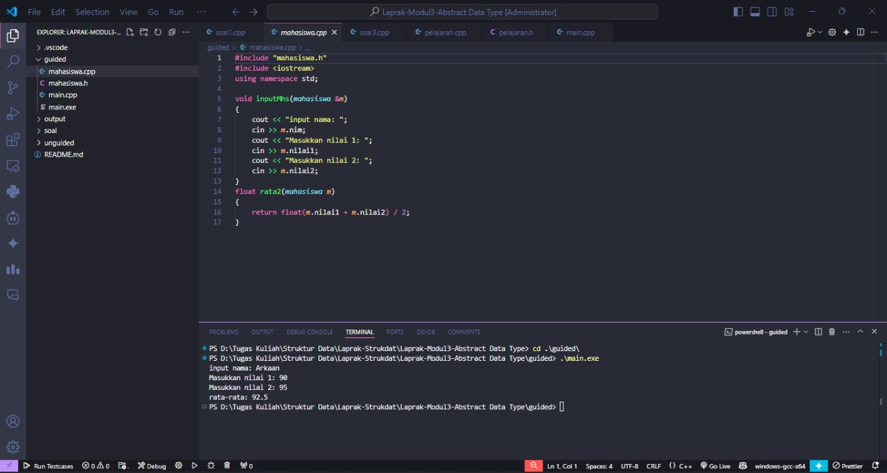
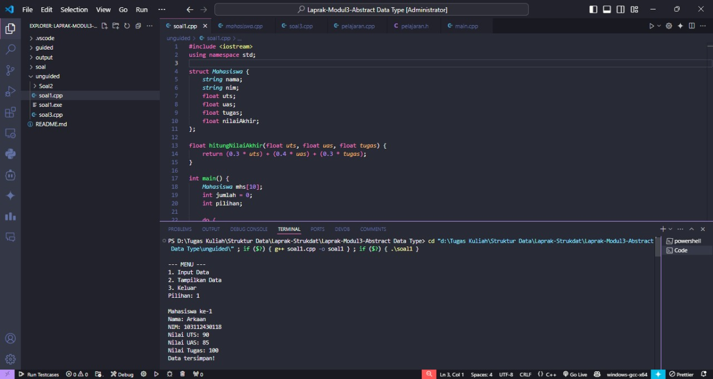
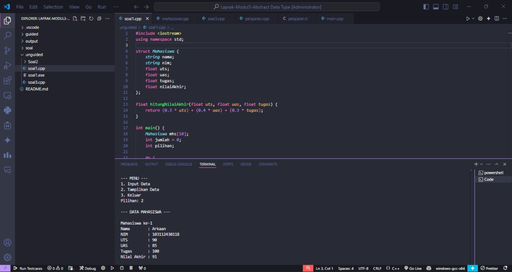
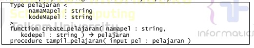
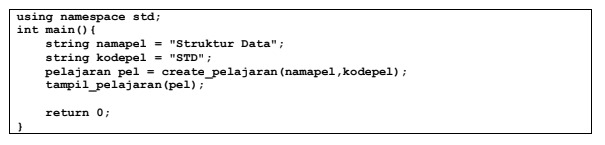
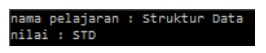
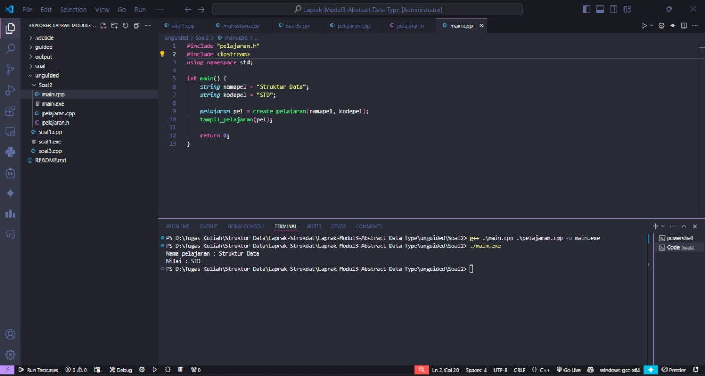
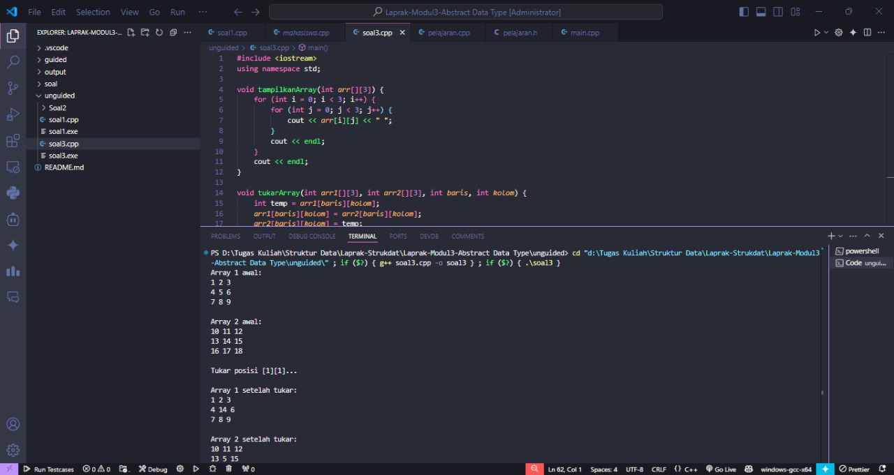
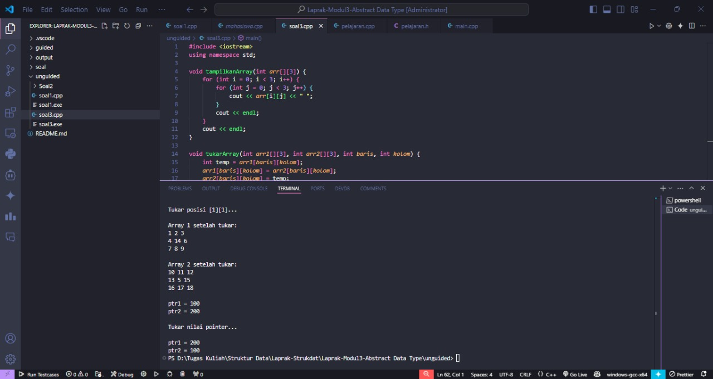

# <h1 align="center">Laporan Praktikum Modul 3<br>Abstract Data Type (ADT)</h1>
<p align="center">Arkaan Wisnu Pratama - 103112430118</p>

## Dasar Teori

Abstract Data Type (ADT) itu sebenarnya konsep dasar dalam pemrograman yang ngejelasin tentang gimana cara kita ngatur dan pake data tanpa harus mikirin detail implementasinya. Jadi, ADT fokusnya lebih ke apa yang bisa dilakukan sama data itu, bukan gimana cara kerjanya di dalam. Misalnya kayak stack, queue, atau list — yang penting kita tahu cara makainya (push, pop, enqueue, dequeue), bukan gimana dia disimpan di memori.

Di C++, ADT biasanya diwujudkan lewat penggunaan class dan struct. Kita bisa nentuin atribut (data) dan fungsi (operasi) yang bisa diakses dari luar, sementara detail implementasi bisa disembunyiin pake konsep encapsulation. Dengan cara ini, program jadi lebih rapi, modular, dan gampang di-maintain karena perubahan di dalam ADT nggak bakal ngaruh langsung ke bagian lain dari program.

Selain itu, ADT juga bikin kode lebih mudah dikembangin dan dipakai ulang. Karena udah terpisah antara logika penggunaan dan cara kerjanya, kita bisa ganti atau ubah implementasi tanpa ngubah cara pemanggilannya. Misalnya, kita bisa ganti cara penyimpanan data di stack dari array ke linked list tanpa ubah kode yang make stack itu. Intinya, ADT ngebantu bikin program lebih fleksibel, efisien, dan mudah diatur.

## Guided

### Soal 1 Modular

#### mahasiswa.cpp

```C++
#include "mahasiswa.h"
#include <iostream>
using namespace std;

void inputMhs(mahasiswa &m) 
{
    cout << "input nama: ";
    cin >> m.nim;
    cout << "Masukkan nilai 1: ";
    cin >> m.nilai1;
    cout << "Masukkan nilai 2: ";
    cin >> m.nilai2;
}
float rata2(mahasiswa m) 
{
    return float(m.nilai1 + m.nilai2) / 2;
}
```

#### mahasiswa.h

```cpp
#ifndef MAHASISWA_H_INCLUDED
#define MAHASISWA_H_INCLUDED

#include <iostream>

struct mahasiswa {
    char nim[10];
    int nilai1, nilai2;
};
void inputMhs(mahasiswa &m);
float rata2(mahasiswa m);
#endif
```

#### main.cpp

```C++
#include <iostream>
#include "mahasiswa.h"
using namespace std;

int main() {

    mahasiswa mhs;
    inputMhs(mhs);
    cout << "rata-rata: " << rata2(mhs) << endl;
    return 0;
}
```
> 

Kode-nya dibagi jadi tiga file biar lebih rapi: mahasiswa.h, mahasiswa.cpp, dan main.cpp.

Di file mahasiswa.h, kita nyimpen struktur mahasiswa yang isinya nim, nilai1, dan nilai2, plus deklarasi fungsi inputMhs() dan rata2(). Terus di mahasiswa.cpp, isinya implementasi dari dua fungsi itu inputMhs() buat masukin data mahasiswa, dan rata2() buat ngitung rata-rata dari dua nilai. Sementara file main.cpp itu bagian utama yang ngejalanin program dengan manggil fungsi-fungsi tadi.

Pembagian kayak gini bikin program lebih teratur, gampang dibaca, dan kalau nanti mau ubah logika di dalam fungsi juga nggak perlu ngubah bagian lain. Jadi lebih efisien dan enak buat dikembangin.

## Unguided

### Soal 1

Buat program yang dapat menyimpan data mahasiswa (max. 10) ke dalam sebuah array dengan field nama, nim, uts, uas, tugas, dan nilai akhir. Nilai akhir diperoleh dari FUNGSI dengan rumus 0.3*uts+0.4*uas+0.3*tugas.

```C++
#include <iostream>
using namespace std;

struct Mahasiswa {
    string nama;
    string nim;
    float uts;
    float uas;
    float tugas;
    float nilaiAkhir;
};

float hitungNilaiAkhir(float uts, float uas, float tugas) {
    return (0.3 * uts) + (0.4 * uas) + (0.3 * tugas);
}

int main() {
    Mahasiswa mhs[10];
    int jumlah = 0;
    int pilihan;
    
    do {
        cout << "\n--- MENU ---" << endl;
        cout << "1. Input Data" << endl;
        cout << "2. Tampilkan Data" << endl;
        cout << "3. Keluar" << endl;
        cout << "Pilihan: ";
        cin >> pilihan;
        
        if (pilihan == 1) {
            if (jumlah < 10) {
                cout << "\nMahasiswa ke-" << (jumlah + 1) << endl;
                
                cout << "Nama: ";
                cin.ignore();
                getline(cin, mhs[jumlah].nama);
                
                cout << "NIM: ";
                getline(cin, mhs[jumlah].nim);
                
                cout << "Nilai UTS: ";
                cin >> mhs[jumlah].uts;
                
                cout << "Nilai UAS: ";
                cin >> mhs[jumlah].uas;
                
                cout << "Nilai Tugas: ";
                cin >> mhs[jumlah].tugas;
                
                mhs[jumlah].nilaiAkhir = hitungNilaiAkhir(mhs[jumlah].uts, 
                                                          mhs[jumlah].uas, 
                                                          mhs[jumlah].tugas);
                
                cout << "Data tersimpan!\n";
                jumlah++;
            } else {
                cout << "Data penuh! (max 10)\n";
            }
        }
        
        else if (pilihan == 2) {
            if (jumlah == 0) {
                cout << "\nBelum ada data!\n";
            } else {
                cout << "\n--- DATA MAHASISWA ---\n";
                for (int i = 0; i < jumlah; i++) {
                    cout << "\nMahasiswa ke-" << (i + 1) << endl;
                    cout << "Nama        : " << mhs[i].nama << endl;
                    cout << "NIM         : " << mhs[i].nim << endl;
                    cout << "UTS         : " << mhs[i].uts << endl;
                    cout << "UAS         : " << mhs[i].uas << endl;
                    cout << "Tugas       : " << mhs[i].tugas << endl;
                    cout << "Nilai Akhir : " << mhs[i].nilaiAkhir << endl;
                }
            }
        }
        
        else if (pilihan == 3) {
            cout << "\nProgram selesai!\n";
        }
        
        else {
            cout << "\nPilihan salah!\n";
        }
        
    } while (pilihan != 3);
    
    return 0;
}
```

> Output
> 
> 

Program ini dibuat buat nyimpen dan nampilin data mahasiswa dengan maksimal 10 data. Di awal ada struct Mahasiswa yang nyimpen beberapa data kayak nama, nim, uts, uas, tugas, sama nilaiAkhir. Terus ada fungsi hitungNilaiAkhir() buat ngitung nilai akhir dari rumus (0.3 * uts) + (0.4 * uas) + (0.3 * tugas).

Di bagian main(), program jalan pakai sistem menu pilihan. Kalau milih 1 (Input Data), user bisa masukin data mahasiswa satu per satu. Data itu disimpan ke array mhs[], dan nilai akhirnya langsung dihitung otomatis. Kalau milih 2 (Tampilkan Data), program bakal nampilin semua data mahasiswa yang udah dimasukin. Kalau belum ada data, bakal muncul pesan “Belum ada data!”.

Terakhir, kalau milih 3 (Keluar), program berhenti. Jadi intinya, program ini ngelatih konsep dasar array of struct, fungsi, dan looping menu di C++ biar data bisa disimpan dan ditampilkan dengan rapi.

### Soal 2

Buatlah ADT pelajaran sebagai berikut di dalam file “pelajaran.h”:

> 

Buatlah implementasi ADT pelajaran pada file “pelajaran.cpp”
Cobalah hasil implementasi ADT pada file “main.cpp”

> 

Contoh output hasil:

> 

#### main.cpp

```C++
#include "pelajaran.h"
#include <iostream>
using namespace std;

int main() {
    string namapel = "Struktur Data";
    string kodepel = "STD";
    
    pelajaran pel = create_pelajaran(namapel, kodepel);
    tampil_pelajaran(pel);
    
    return 0;
}
```
#### pelajaran.cpp

```C++
#include "pelajaran.h"
#include <iostream>
using namespace std;

pelajaran create_pelajaran(string namapel, string kodepel) {
    pelajaran pel;
    pel.namaPel = namapel;
    pel.kodePel = kodepel;
    return pel;
}

void tampil_pelajaran(pelajaran pel) {
    cout << "Nama pelajaran : " << pel.namaPel << endl;
    cout << "Nilai : " << pel.kodePel << endl;
}
```

#### pelajaran.h

```cpp
#ifndef PELAJARAN_H
#define PELAJARAN_H

#include <string>
using namespace std;

struct pelajaran {
    string namaPel;
    string kodePel;
};

pelajaran create_pelajaran(string namapel, string kodepel);
void tampil_pelajaran(pelajaran pel);

#endif
```

> Output
> 

Program di atas itu contoh sederhana penerapan ADT (Abstract Data Type) buat data pelajaran di C++.
Kode-nya dibagi jadi tiga file biar lebih teratur: pelajaran.h buat deklarasi, pelajaran.cpp buat implementasi fungsi, dan main.cpp buat jalanin program utamanya.

Di pelajaran.h, ada struct pelajaran yang nyimpen dua data yaitu namaPel dan kodePel. Terus di pelajaran.cpp, ada fungsi create_pelajaran() buat bikin objek pelajaran baru dan ngisi datanya, sama tampil_pelajaran() buat nampilin isi datanya ke layar.

Di main.cpp, program nyiptain data pelajaran dengan nama "Struktur Data" dan kode "STD", terus dipanggil pake tampil_pelajaran() biar hasilnya ditampilin. Intinya, program ini nunjukin gimana cara pake struct dan fungsi dalam bentuk modular biar program lebih rapi dan gampang diatur.

### Soal 3

Buatlah program dengan ketentuan :
- 2 buah array 2D integer berukuran 3x3 dan 2 buah pointer integer
- fungsi/prosedur yang menampilkan isi sebuah array integer 2D
- fungsi/prosedur yang akan menukarkan isi dari 2 array integer 2D pada posisi tertentu
- fungsi/prosedur yang akan menukarkan isi dari variabel yang ditunjuk oleh 2 buah pointer

```C++
#include <iostream>
using namespace std;

void tampilkanArray(int arr[][3]) {
    for (int i = 0; i < 3; i++) {
        for (int j = 0; j < 3; j++) {
            cout << arr[i][j] << " ";
        }
        cout << endl;
    }
    cout << endl;
}

void tukarArray(int arr1[][3], int arr2[][3], int baris, int kolom) {
    int temp = arr1[baris][kolom];
    arr1[baris][kolom] = arr2[baris][kolom];
    arr2[baris][kolom] = temp;
}

void tukarPointer(int *ptr1, int *ptr2) {
    int temp = *ptr1;
    *ptr1 = *ptr2;
    *ptr2 = temp;
}

int main() {
    int array1[3][3] = {
        {1, 2, 3},
        {4, 5, 6},
        {7, 8, 9}
    };
    
    int array2[3][3] = {
        {10, 11, 12},
        {13, 14, 15},
        {16, 17, 18}
    };
    
    int a = 100;
    int b = 200;
    int *ptr1 = &a;
    int *ptr2 = &b;
    
    cout << "Array 1 awal:" << endl;
    tampilkanArray(array1);
    
    cout << "Array 2 awal:" << endl;
    tampilkanArray(array2);
    
    cout << "Tukar posisi [1][1]..." << endl << endl;
    tukarArray(array1, array2, 1, 1);
    
    cout << "Array 1 setelah tukar:" << endl;
    tampilkanArray(array1);
    
    cout << "Array 2 setelah tukar:" << endl;
    tampilkanArray(array2);
    
    cout << "ptr1 = " << *ptr1 << endl;
    cout << "ptr2 = " << *ptr2 << endl;
    
    cout << "\nTukar nilai pointer..." << endl << endl;
    tukarPointer(ptr1, ptr2);
    
    cout << "ptr1 = " << *ptr1 << endl;
    cout << "ptr2 = " << *ptr2 << endl;
    
    return 0;
}
```

Di awal, ada dua fungsi penting: tampilkanArray() buat nampilin isi array 3x3, dan tukarArray() buat nuker satu elemen antara dua array di posisi tertentu. Misalnya di program ini, elemen di posisi [1][1] dari array1 dan array2 ditukar isinya.

Selain itu, ada juga fungsi tukarPointer() yang gunanya buat nuker nilai dari dua variabel lewat pointer. Di main(), variabel a dan b awalnya bernilai 100 dan 200, terus ditukar nilainya lewat fungsi itu.

Jadi intinya, program ini ngelatih gimana cara ngakses dan ngubah data lewat indeks array dan pointer. Selain itu, juga nunjukin perbedaan antara tukar data langsung lewat array dan tukar data lewat alamat memori (pointer).

> Output
> 
> 

## Referensi
1. Sengupta, S., & Korobkin, C. P. (2012). C++: object-oriented data structures. Springer.
2. Schmidt, D. C., ADTs, D. O. U., & ADTs, B. I. C++ Support for Abstract Data Types.
3. Kutti, N. S., & Padhye, P. Y. (1998). Data Structures in C++. PHI Learning Pvt. Ltd..
