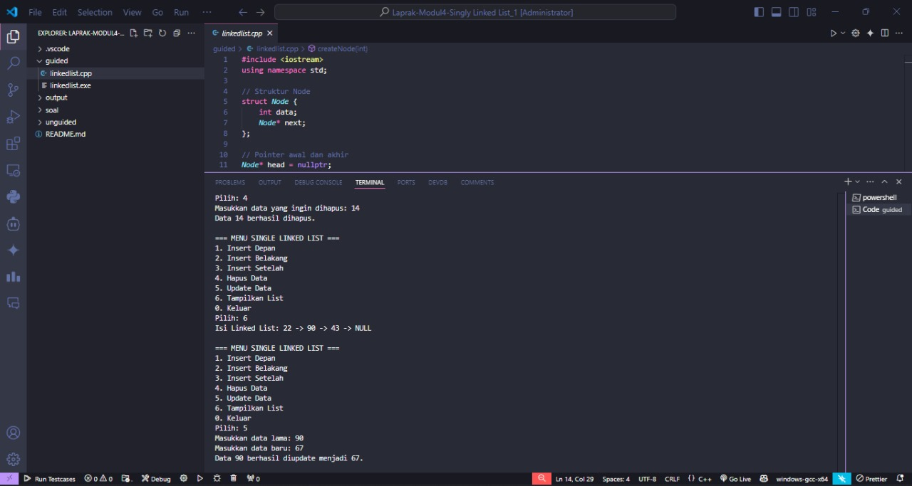

# <h1 align="center">Laporan Praktikum Modul 2<br>Singly Linked List 1</h1>
<p align="center">Arkaan Wisnu Pratama - 103112430118</p>

## Dasar Teori

Singly Linked List adalah salah satu struktur data dinamis di C++ yang terdiri dari sekumpulan elemen yang disebut node. Setiap node punya dua bagian penting: data untuk nyimpan nilai dan pointer next yang nunjuk ke node berikutnya. Berbeda sama array yang ukurannya tetap, linked list bisa nambah atau ngurang elemen kapan aja tanpa perlu ngatur ulang ukuran memori. Karena tiap node disambungin pakai pointer, posisi data di memori gak harus berurutan.

Dalam singly linked list, alur datanya satu arah aja — dari node pertama (head) sampai node terakhir (tail) yang penunjuknya next bernilai NULL. Buat ngelakuin operasi seperti nambah, hapus, atau cari data, program harus melalui node satu per satu mulai dari head. Karena itu, aksesnya lebih lambat dibanding array, tapi lebih fleksibel buat manipulasi data. Struktur ini cocok dipakai waktu jumlah data sering berubah-ubah atau gak diketahui di awal.

Implementasi singly linked list di C++ biasanya pakai struct buat definisi node dan pointer buat nyambung antar node. Operasi dasarnya meliputi insert (tambah data di depan, tengah, atau belakang), delete (hapus data tertentu), update (ubah isi data), dan display (tampilkan semua isi list). Semua operasi ini dilakukan dengan cara ngatur pointer next biar alur linked list tetap nyambung tanpa error.

## Guided

### soal 1 Linked List

```C++
#include <iostream>
using namespace std;

// Struktur Node
struct Node {
    int data;
    Node* next;
};

// Pointer awal dan akhir
Node* head = nullptr;

// Fungsi untuk membuat node baru
Node* createNode(int data) {
    Node* newNode = new Node();
    newNode->data = data;
    newNode->next = nullptr;
    return newNode;
}

void insertDepan(int data) {
    Node* newNode = createNode(data);
    newNode->next = head;
    head = newNode;
    cout << "Data" << data << "Berhasil ditambahkan di depan.\n" << endl;
}

void insertBelakang(int data) {
    Node* newNode = createNode(data);
    if (head == nullptr) {
        head = newNode;
    } else {
        Node* temp = head;
        while (temp->next != nullptr) {
            temp = temp->next;
        }
        temp->next = newNode;
    }
    cout << "Data " << data << " berhasil ditambahkan di belakang.\n";
}

void insertSetelah(int target, int dataBaru) {
    Node* temp = head;
    while (temp != nullptr && temp->data != target) {
        temp = temp->next;
    }

    if (temp == nullptr) {
        cout << "Data " << target << " tidak ditemukan!\n";
    } else {
        Node* newNode = createNode(dataBaru);
        newNode->next = temp->next;
        temp->next = newNode;
        cout << "Data " << dataBaru << " berhasil disisipkan setelah " << target << ".\n";
    }
}

// ========== DELETE FUNCTION ==========
void hapusNode(int data) {
    if (head == nullptr) {
        cout << "List kosong!\n";
        return;
    }

    Node* temp = head;
    Node* prev = nullptr;

    // Jika data di node pertama
    if (temp != nullptr && temp->data == data) {
        head = temp->next;
        delete temp;
        cout << "Data " << data << " berhasil dihapus.\n";
        return;
    }

    // Cari node yang akan dihapus
    while (temp != nullptr && temp->data != data) {
        prev = temp;
        temp = temp->next;
    }

    // Jika data tidak ditemukan
    if (temp == nullptr) {
        cout << "Data " << data << " tidak ditemukan!\n";
        return;
    }

    prev->next = temp->next;
    delete temp;
    cout << "Data " << data << " berhasil dihapus.\n";
}

// ========== UPDATE FUNCTION ==========
void updateNode(int dataLama, int dataBaru) {
    Node* temp = head;
    while (temp != nullptr && temp->data != dataLama) {
        temp = temp->next;
    }

    if (temp == nullptr) {
        cout << "Data " << dataLama << " tidak ditemukan!\n";
    } else {
        temp->data = dataBaru;
        cout << "Data " << dataLama << " berhasil diupdate menjadi " << dataBaru << ".\n";
    }
}

// ========== DISPLAY FUNCTION ==========
void tampilkanList() {
    if (head == nullptr) {
        cout << "List kosong!\n";
        return;
    }

    Node* temp = head;
    cout << "Isi Linked List: ";
    while (temp != nullptr) {
        cout << temp->data << " -> ";
        temp = temp->next;
     }
    cout << "NULL\n";
}

// ========== MAIN PROGRAM ==========
int main() {
    int pilihan, data, target, dataBaru;

    do {
        cout << "\n=== MENU SINGLE LINKED LIST ===\n";
        cout << "1. Insert Depan\n";
        cout << "2. Insert Belakang\n";
        cout << "3. Insert Setelah\n";
        cout << "4. Hapus Data\n";
        cout << "5. Update Data\n";
        cout << "6. Tampilkan List\n";
        cout << "0. Keluar\n";
        cout << "Pilih: ";
        cin >> pilihan;

        switch (pilihan) {
            case 1:
                cout << "Masukkan data: ";
                cin >> data;
                insertDepan(data);
                break;
            case 2:
                cout << "Masukkan data: ";
                cin >> data;
                insertBelakang(data);
                break;
            case 3:
                cout << "Masukkan data target: ";
                cin >> target;
                cout << "Masukkan data baru: ";
                cin >> dataBaru;
                insertSetelah(target, dataBaru);
                break;
            case 4:
                cout << "Masukkan data yang ingin dihapus: ";
                cin >> data;
                hapusNode(data);
                break;
            case 5:
                cout << "Masukkan data lama: ";
                cin >> data;
                cout << "Masukkan data baru: ";
                cin >> dataBaru;
                updateNode(data, dataBaru);
                break;
            case 6:
                tampilkanList();
                break;
            case 0:
                cout << "Program selesai.\n";
                break;
            default:
                cout << "Pilihan tidak valid!\n";
        }
    } while (pilihan != 0);

    return 0;
}
```
Program di atas adalah implementasi Single Linked List dalam C++ yang memungkinkan pengguna buat nambah, hapus, ubah, dan lihat data dalam bentuk list yang terhubung satu arah. Setiap data disimpan dalam node yang punya dua bagian: data dan pointer next yang nunjuk ke node berikutnya. Program ini punya fitur insert di depan, belakang, dan setelah data tertentu, lalu juga bisa hapus node berdasarkan nilai, update isi node, dan tampilkan seluruh isi list. Semua operasi bisa dilakukan lewat menu interaktif di terminal.

> 

Insert Depan buat nambah data baru di awal list.

> 

Insert Belakang nambah data di bagian akhir list.

> 

Insert Setelah nyisipin data baru setelah data tertentu yang udah ada.

> 

Hapus Data ngilangin node yang isinya sesuai dengan data yang dimasukin.

> 

Update Data ganti nilai data lama jadi data baru yang dimau user.
Tampilkan List itu untuk Nampilkan list Data yang ada


## Unguided

### Soal 1

buatlah single linked list untuk Antrian yang menyimpan data pembeli( nama dan pesanan). program memiliki beberapa menu seperti tambah antrian,  layani antrian(hapus), dan tampilkan antrian. \*antrian pertama harus yang pertama dilayani

```C++
#include <iostream>
#include <string>
using namespace std;

struct Pembeli {
    string nama;
    string pesanan;
    Pembeli* next;
};

Pembeli* depan = NULL;
Pembeli* belakang = NULL;

void tambahAntrian() {
    Pembeli* baru = new Pembeli();
    
    cout << "\nNama: ";
    getline(cin, baru->nama);
    cout << "Pesanan: ";
    getline(cin, baru->pesanan);
    baru->next = NULL;
    
    if (depan == NULL) {
        depan = belakang = baru;
    } else {
        belakang->next = baru;
        belakang = baru;
    }
    
    cout << "✓ Berhasil ditambahkan!\n";
}

void layaniAntrian() {
    if (depan == NULL) {
        cout << "\n✗ Antrian kosong!\n";
        return;
    }
    
    cout << "\n=== MELAYANI ===\n";
    cout << "Nama: " << depan->nama << endl;
    cout << "Pesanan: " << depan->pesanan << endl;
    
    Pembeli* temp = depan;
    depan = depan->next;
    
    if (depan == NULL) {
        belakang = NULL;
    }
    
    delete temp;
    cout << "✓ Selesai dilayani!\n";
}

void tampilkanAntrian() {
    if (depan == NULL) {
        cout << "\n✗ Antrian kosong!\n";
        return;
    }
    
    cout << "\n===== ANTRIAN =====\n";
    Pembeli* sekarang = depan;
    int nomor = 1;
    
    while (sekarang != NULL) {
        cout << nomor << ". " << sekarang->nama;
        cout << " - " << sekarang->pesanan << endl;
        sekarang = sekarang->next;
        nomor++;
    }
    cout << "===================\n";
}

int main() {
    int pilih;
    
    do {
        cout << "\n=== ANTRIAN PEMBELI ===\n";
        cout << "1. Tambah Antrian\n";
        cout << "2. Layani Antrian\n";
        cout << "3. Lihat Antrian\n";
        cout << "4. Keluar\n";
        cout << "Pilih: ";
        cin >> pilih;
        cin.ignore();
        
        if (pilih == 1) {
            tambahAntrian();
        } else if (pilih == 2) {
            layaniAntrian();
        } else if (pilih == 3) {
            tampilkanAntrian();
        } else if (pilih == 4) {
            cout << "\nTerima kasih!\n";
        } else {
            cout << "\n✗ Pilihan salah!\n";
        }
        
    } while (pilih != 4);
    
    return 0;
}
```
Program di atas tuh simulasi antrian pembeli pakai linked list di C++. Tiap pembeli nyimpen nama sama pesanan, terus dihubungin satu per satu kayak rantai. Programnya bisa nambah pembeli baru ke antrian, layani pembeli paling depan, dan lihat semua yang lagi ngantri. Pas pembeli udah dilayanin, datanya langsung dihapus biar gantian sama yang berikutnya.

> Output
> 

> 

### Soal 2

buatlah program kode untuk membalik (reverse) singly linked list (1-2-3 menjadi 3-2-1) 

```C++
#include <iostream>
using namespace std;

struct Node {
    int data;
    Node* next;
};

void tambah(Node** head, int data) {
    Node* baru = new Node();
    baru->data = data;
    baru->next = nullptr;
    
    if (*head == nullptr) {
        *head = baru;
    } else {
        Node* temp = *head;
        while (temp->next != nullptr) {
            temp = temp->next;
        }
        temp->next = baru;
    }
}

void balik(Node** head) {
    Node* sebelum = nullptr;
    Node* sekarang = *head;
    Node* sesudah = nullptr;
    
    while (sekarang != nullptr) {
        sesudah = sekarang->next;
        sekarang->next = sebelum;
        sebelum = sekarang;
        sekarang = sesudah;
    }
    *head = sebelum;
}

void tampilkan(Node* head) {
    while (head != nullptr) {
        cout << head->data;
        if (head->next != nullptr)
            cout << " -> ";
        head = head->next;
    }
    cout << endl;
}

int main() {
    Node* head = nullptr;
    int n, data;
    
    cout << "Jumlah elemen: ";
    cin >> n;
    
    for (int i = 0; i < n; i++) {
        cout << "Data ke-" << i + 1 << ": ";
        cin >> data;
        tambah(&head, data);
    }
    
    cout << "\nSebelum dibalik: ";
    tampilkan(head);
    
    balik(&head);
    
    cout << "Setelah dibalik: ";
    tampilkan(head);
    
    return 0;
}
```

> Output
> 

Program di atas tuh buat membalik urutan data di singly linked list pakai C++. Awalnya user masukin beberapa data, terus data itu disimpan ke dalam node yang saling nyambung dari depan ke belakang. Setelah semua data dimasukin, program nampilin urutan awalnya, lalu dibalik pakai fungsi balik() biar urutannya jadi dari belakang ke depan. Proses pembalikan dilakukan dengan cara ngubah arah pointer tiap node. Hasil akhirnya ditampilin lagi biar keliatan perbedaan sebelum dan sesudah dibalik.

## Referensi
1. Furcy, D. (2009). JHAVEPOP: Visualizing linked-list operations in C++ and Java. Journal of Computing Sciences in Colleges, 25(1), 32-41.
2. Kale, M. (2017). Linked List Visualizer Tutor for C++.
3. Castillo III, L. S. (2016). Interactive System for Visualization of Linked List Operations in C++.
