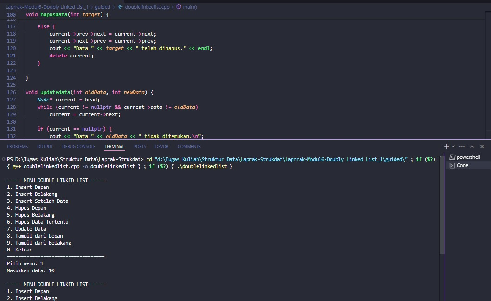
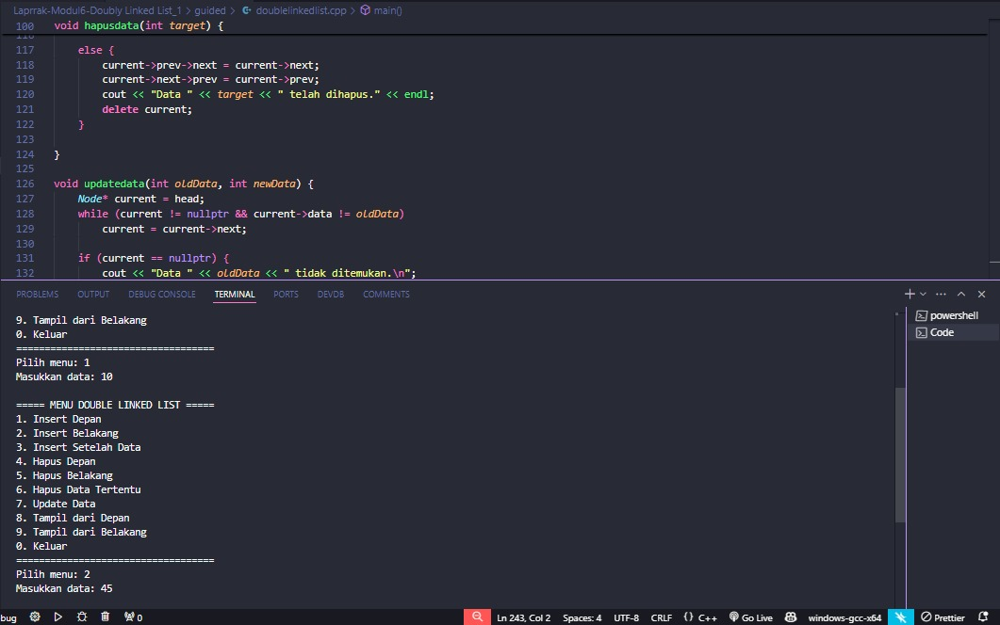
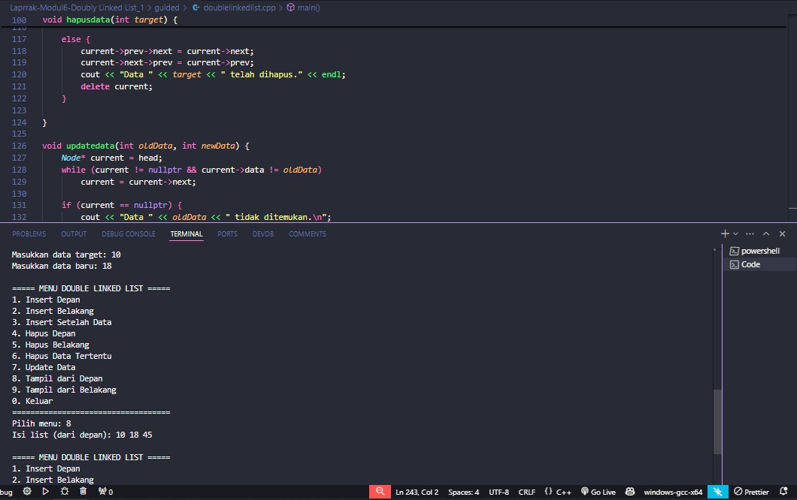
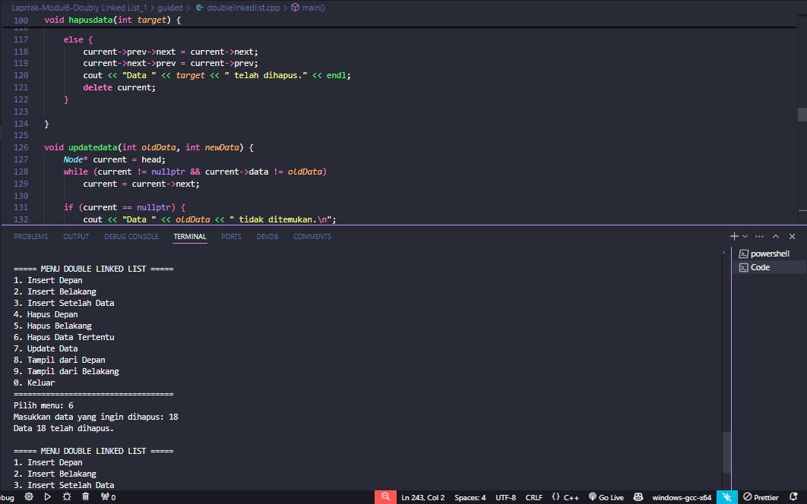
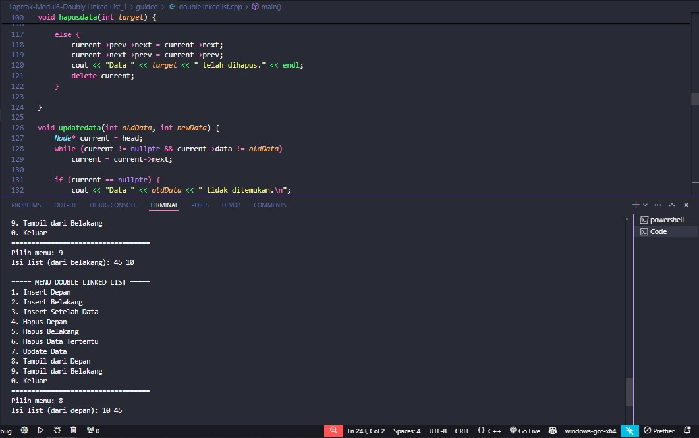
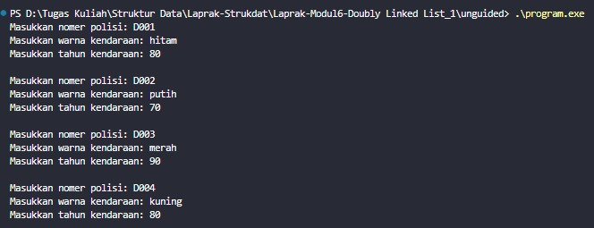
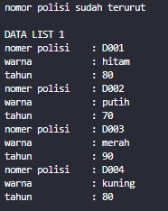
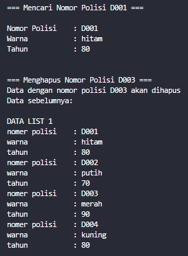
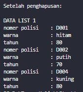

# <h1 align="center">Laporan Praktikum Modul 6<br>Doubly Linked List</h1>
<p align="center">Arkaan Wisnu Pratama - 103112430118</p>

## Dasar Teori

Doubly Linked List adalah salah satu struktur data dinamis di C++ yang mirip dengan singly linked list, tetapi punya kemampuan navigasi dua arah. Setiap elemen disebut node dan di dalamnya terdapat tiga bagian penting: data untuk nyimpan nilai, pointer prev yang nunjuk ke node sebelumnya, dan pointer next yang nunjuk ke node berikutnya. Berbeda dengan array yang ukuran memori dan posisinya tetap, doubly linked list bisa nambah atau ngurang elemen dengan fleksibel tanpa harus mindahin atau nyusun ulang data di memori. Karena tiap node saling terhubung lewat dua pointer, posisi data di memori juga tidak harus berurutan.

Di Doubly Linked List, alur datanya bisa bergerak ke dua arah — dari head ke tail lewat pointer next, atau dari tail balik lagi ke head lewat pointer prev. Fitur dua arah ini bikin beberapa operasi jadi lebih efisien, misalnya ketika ingin traversing mundur atau menghapus node tertentu tanpa harus mulai dari awal. Meski lebih fleksibel, struktur ini juga membutuhkan memori tambahan karena setiap node punya dua pointer. Tetap saja, ia lebih powerful untuk kasus yang butuh navigasi dua arah atau sering manipulasi data di bagian tengah list.

Implementasi doubly linked list di C++ biasanya menggunakan struct atau class untuk mendefinisikan node, lengkap dengan pointer prev dan next sebagai penghubung. Operasi dasarnya meliputi insert (tambah data di depan, tengah, atau belakang), delete (hapus node tertentu), update (ubah data di dalam node), dan display (tampilkan isi list dari depan atau dari belakang). Semua operasi ini dilakukan dengan hati-hati mengatur pointer prev dan next supaya hubungan antar node tetap konsisten dan tidak membuat list rusak. Struktur ini cocok dipakai ketika butuh akses bolak-balik atau manipulasi data yang fleksibel.

## Guided

### Double Linked List

```C++
#include <iostream>
using namespace std;

struct Node {

    int data;
    Node* next;
    Node* prev;

};

Node* head = nullptr;
Node* tail = nullptr;

void insertdepan(int data){
    Node* newNode = new Node();
    newNode->data = data;
    newNode->next = head;
    newNode->prev = nullptr;

    if (head != nullptr) {
        head->prev = newNode;
    } else {
        tail = newNode; 
    }
    head = newNode;

}


void insertbelakang(int data){
    Node* newNode = new Node();
    newNode->data = data;
    newNode->next = nullptr;
    newNode->prev = tail;

    if (tail != nullptr) {
        tail->next = newNode;
    } else {
        head = newNode; 
    }
    tail = newNode;

}

void insertsetelah (int target, int data) {
    Node* current = head;
    while (current != nullptr && current->data != target) {
        current = current->next;
    }

    if (current != nullptr) {
        Node* newNode = new Node();
        newNode->data = data;
        newNode->next = current->next;
        newNode->prev = current;

        if (current->next != nullptr) {
            current->next->prev = newNode;
        } else {
            tail = newNode; 
        }
        current->next = newNode; 
    }
}
void hapusdepan() {
    if (head == nullptr){
        cout << "list kosong" << endl;
        return;
    } 

    Node* temp = head;
    head = head->next;

    if (head != nullptr) {
        head->prev = nullptr;
    } else {
        tail = nullptr; 
    }
    delete temp;
}

void hapusbelakang() {
    if (tail == nullptr){
        cout << "list kosong" << endl;
        return;
    } 

    Node* temp = tail;
    tail = tail->prev;

    if (tail != nullptr) {
        tail->next = nullptr;
    } else {
        head = nullptr; 
    }
    delete temp;
}

void hapusdata(int target) {
    Node* current = head;
    while (current != nullptr && current->data != target) {
        current = current->next;
    }

    if (current == nullptr) {
        cout << "Data " << target << " tidak ditemukan." << endl;
        return;
    }

    if (current == head) {
        hapusdepan();
    } else if (current == tail) {
        hapusbelakang();
    }

    else {
        current->prev->next = current->next;
        current->next->prev = current->prev;
        cout << "Data " << target << " telah dihapus." << endl; 
        delete current;
    }

}

void updatedata(int oldData, int newData) {
    Node* current = head;
    while (current != nullptr && current->data != oldData)
        current = current->next;

    if (current == nullptr) {
        cout << "Data " << oldData << " tidak ditemukan.\n";
        return;
    }

    current->data = newData;
    cout << "Data " << oldData << " diubah menjadi " << newData << ".\n";
}

void tampildepan() {
    if (head == nullptr) {
        cout << "List kosong.\n";
        return;
    }

    cout << "Isi list (dari depan): ";
    Node* current = head;
    while (current != nullptr) {
        cout << current->data << " ";
        current = current->next;
    }
    cout << "\n";
}


void tampilbelakang() {
    if (tail == nullptr) {
        cout << "List kosong.\n";
        return;
    }

    cout << "Isi list (dari belakang): ";
    Node* current = tail;
    while (current != nullptr) {
        cout << current->data << " ";
        current = current->prev;
    }
    cout << "\n";
}


int main() {
    int pilihan, data, target, oldData, newData;

    do {
        cout << "\n===== MENU DOUBLE LINKED LIST =====\n";
        cout << "1. Insert Depan\n";
        cout << "2. Insert Belakang\n";
        cout << "3. Insert Setelah Data\n";
        cout << "4. Hapus Depan\n";
        cout << "5. Hapus Belakang\n";
        cout << "6. Hapus Data Tertentu\n";
        cout << "7. Update Data\n";
        cout << "8. Tampil dari Depan\n";
        cout << "9. Tampil dari Belakang\n";
        cout << "0. Keluar\n";
        cout << "===================================\n";
        cout << "Pilih menu: ";
        cin >> pilihan;

        switch (pilihan) {
            case 1:
                cout << "Masukkan data: ";
                cin >> data;
                insertdepan(data);
                break;
            case 2:
                cout << "Masukkan data: ";
                cin >> data;
                insertbelakang(data);
                break;
            case 3:
                cout << "Masukkan data target: ";
                cin >> target;
                cout << "Masukkan data baru: ";
                cin >> data;
                insertsetelah(target, data);
                break;
            case 4:
                hapusdepan();
                break;
            case 5:
                hapusbelakang();
                break;
            case 6:
                cout << "Masukkan data yang ingin dihapus: ";
                cin >> target;
                hapusdata(target);
                break;
            case 7:
                cout << "Masukkan data lama: ";
                cin >> oldData;
                cout << "Masukkan data baru: ";
                cin >> newData;
                updatedata(oldData, newData);
                break;
            case 8:
                tampildepan();
                break;
            case 9:
                tampilbelakang();
                break;
            case 0:
                cout << "👋 Keluar dari program.\n";
                break;
            default:
                cout << "Pilihan tidak valid.\n";
        }

    } while (pilihan != 0);

    return 0;
}
```
Ini program Doubly Linked List yang bisa nambah, hapus, update, dan nampilin data dari depan atau belakang. Setiap node punya data, pointer next, sama pointer prev biar bisa jalan dua arah. Kamu bisa insert di depan, belakang, atau setelah data tertentu, dan hapus juga bisa dari mana aja. Traversal-nya fleksibel karena ada prev dan next, jadi akses dari dua arah tetap gampang.

> 
> 
> 
> 
> 
> 

## Unguided

### Doublylist.h

```cpp
#ifndef DOUBLYLIST_H
#define DOUBLYLIST_H

#include <string>
using namespace std;

struct infotype {
    string nopol;
    string warna;
    int thnBuat;
};

typedef struct ElmList *address;

struct ElmList {
    infotype info;
    address next;
    address prev;
};

struct List {
    address First;
    address Last;
};

void createList(List &L);
address alokasi(infotype x);
void dealokasi(address &P);
void printInfo(List L);
void insertLast(List &L, address P);
address findElm(List L, infotype x);
void deleteFirst(List &L, address &P);
void deleteLast(List &L, address &P);
void deleteAfter(address Prec, address &P);

#endif
```
Header ini nyiapin struktur dasar buat Doubly Linked List yang isinya data kendaraan kayak nopol, warna, sama tahun buat. Setiap node punya info plus pointer next dan prev biar bisa gerak dua arah. Ada juga struct List yang nyimpen posisi First dan Last biar gampang ngeakses awal dan akhir list. Fungsinya lengkap mulai dari bikin list, alokasi node, insert di belakang, cari data, sampe hapus node di depan, belakang, atau setelah node tertentu. Intinya ini dasar template buat ngatur data kendaraan pakai doubly linked list.

### Doublylist.cpp

```C++
#include "Doublylist.h"
#include <iostream>
using namespace std;

void createList(List &L) {
    L.First = NULL;
    L.Last = NULL;
}

address alokasi(infotype x) {
    address P = new ElmList;
    P->info = x;
    P->next = NULL;
    P->prev = NULL;
    return P;
}

void dealokasi(address &P) {
    delete P;
    P = NULL;
}

void printInfo(List L) {
    address P = L.First;
    cout << "\nDATA LIST 1" << endl;
    while (P != NULL) {
        cout << "nomer polisi\t: " << P->info.nopol << endl;
        cout << "warna\t\t: " << P->info.warna << endl;
        cout << "tahun\t\t: " << P->info.thnBuat << endl;
        P = P->next;
    }
}

void insertLast(List &L, address P) {
    if (L.First == NULL) {
        L.First = P;
        L.Last = P;
    } else {
        P->prev = L.Last;
        L.Last->next = P;
        L.Last = P;
    }
}

address findElm(List L, infotype x) {
    address P = L.First;
    while (P != NULL) {
        if (P->info.nopol == x.nopol) {
            return P;
        }
        P = P->next;
    }
    return NULL;
}

void deleteFirst(List &L, address &P) {
    if (L.First != NULL) {
        P = L.First;
        if (L.First == L.Last) {
            L.First = NULL;
            L.Last = NULL;
        } else {
            L.First = P->next;
            L.First->prev = NULL;
            P->next = NULL;
        }
    }
}

void deleteLast(List &L, address &P) {
    if (L.First != NULL) {
        P = L.Last;
        if (L.First == L.Last) {
            L.First = NULL;
            L.Last = NULL;
        } else {
            L.Last = P->prev;
            L.Last->next = NULL;
            P->prev = NULL;
        }
    }
}

void deleteAfter(address Prec, address &P) {
    if (Prec != NULL && Prec->next != NULL) {
        P = Prec->next;
        Prec->next = P->next;
        if (P->next != NULL) {
            P->next->prev = Prec;
        }
        P->next = NULL;
        P->prev = NULL;
    }
}
```

Kode ini ngatur operasi dasar buat Doubly Linked List yang nyimpen data kendaraan kayak nopol, warna, dan tahun buat. Ada fungsi buat bikin list baru, alokasi node, dan nampilin semua isi list dari depan. InsertLast dipakai buat nambah data di bagian akhir list, sedangkan findElm dipakai buat nyari node berdasarkan nopol. Untuk hapus data, tersedia deleteFirst, deleteLast, dan deleteAfter yang ngatur pointer prev-next biar list tetap nyambung. Intinya, file ini nge-handle seluruh operasi dasar yang dibutuhin biar list bisa jalan mulus.

### main.cpp

```C++
#include "Doublylist.h"
#include <iostream>
using namespace std;

int main() {
    List L;
    address P;
    infotype data;
    
    createList(L);
    
    data.nopol = "D001";
    data.warna = "hitam";
    data.thnBuat = 80;
    P = alokasi(data);
    insertLast(L, P);
    
    data.nopol = "D002";
    data.warna = "putih";
    data.thnBuat = 70;
    P = alokasi(data);
    insertLast(L, P);
    
    data.nopol = "D003";
    data.warna = "merah";
    data.thnBuat = 90;
    P = alokasi(data);
    insertLast(L, P);
    
    data.nopol = "D004";
    data.warna = "kuning";
    data.thnBuat = 80;
    P = alokasi(data);
    insertLast(L, P);
    
    cout << "Masukkan nomer polisi: D001" << endl;
    cout << "Masukkan warna kendaraan: hitam" << endl;
    cout << "Masukkan tahun kendaraan: 80" << endl;
    cout << "\nMasukkan nomer polisi: D002" << endl;
    cout << "Masukkan warna kendaraan: putih" << endl;
    cout << "Masukkan tahun kendaraan: 70" << endl;
    cout << "\nMasukkan nomer polisi: D003" << endl;
    cout << "Masukkan warna kendaraan: merah" << endl;
    cout << "Masukkan tahun kendaraan: 90" << endl;
    cout << "\nMasukkan nomer polisi: D004" << endl;
    cout << "Masukkan warna kendaraan: kuning" << endl;
    cout << "Masukkan tahun kendaraan: 80" << endl;
    cout << "\nnomor polisi sudah terurut" << endl;
    
    printInfo(L);
    
    cout << "\n\n=== Mencari Nomor Polisi D001 ===" << endl;
    data.nopol = "D001";
    P = findElm(L, data);
    if (P != NULL) {
        cout << "\nNomor Polisi\t: " << P->info.nopol << endl;
        cout << "Warna\t\t: " << P->info.warna << endl;
        cout << "Tahun\t\t: " << P->info.thnBuat << endl;
    }
    
    cout << "\n\n=== Menghapus Nomor Polisi D003 ===" << endl;
    data.nopol = "D003";
    P = findElm(L, data);
    if (P != NULL) {
        cout << "Data dengan nomor polisi D003 akan dihapus" << endl;
        cout << "Data sebelumnya:" << endl;
        printInfo(L);
        
        if (P == L.First) {
            deleteFirst(L, P);
        } else if (P == L.Last) {
            deleteLast(L, P);
        } else {
            deleteAfter(P->prev, P);
        }
        dealokasi(P);
        
        cout << "\nSetelah penghapusan:" << endl;
        printInfo(L);
    }
    
    return 0;
}
```
Program ini ngejalanin operasi Doubly Linked List mulai dari nambah data kendaraan, nyari data, sampe hapus data tertentu. Di awal, program bikin list kosong lalu masukin empat data kendaraan secara berurutan pakai insertLast. Setelah semua data masuk, program nampilin isi list dan nunjukkin kalau nomornya udah terurut. Lalu program nyari nomor polisi "D001" buat dicek datanya, dan setelah itu ngehapus data dengan nomor polisi "D003". Setelah penghapusan, list ditampilin lagi buat nunjukkin perubahan datanya.

> Output
> 
> 
> 
> 

## Referensi
1.Dinata, R. K., & Hasdyna, N. (2025). Algoritma dan Pemrograman: Konsep Dasar, Logika, dan Implementasi dengan C++ & Python. Serasi Media Teknologi. https://books.google.com/books?hl=id&lr=&id=6kBlEQAAQBAJ&oi=fnd&pg=PA1&dq=bahasa+pemrograman+c%2B%2B+array&ots=bk_HI3xSBN&sig=1Hpd0ZgsybwRJiWdhlV3mCEAe6w
Guntara, R. G. (2023). ALGORITMA DAN PEMROGRAMAN DASAR: Menggunakan Bahasa Pemrograman C++ dengan Contoh Kasus Aplikasi untuk Bisnis dan Manajemen. CV. 

2.Ruang Tentor. https://books.google.com/books?hl=id&lr=&id=NO_LEAAAQBAJ&oi=fnd&pg=PP1&dq=bahasa+pemrograman+c%2B%2B+array&ots=2Fy9t5bo-6&sig=IEpObWmOGnSM-_hcwcGMRc3y-2A

3.Anita Sindar, R. M. S. (2019). Struktur Data Dan Algoritma Dengan C++ (Vol. 1). CV. AA. RIZKY. https://books.google.com/books?hl=id&lr=&id=GP_ADwAAQBAJ&oi=fnd&pg=PA23&dq=bahasa+pemrograman+c%2B%2B+pointer&ots=86j8Vl4PeN&sig=Y8PH3MxqztsFCr6HnjJIKfS--ow