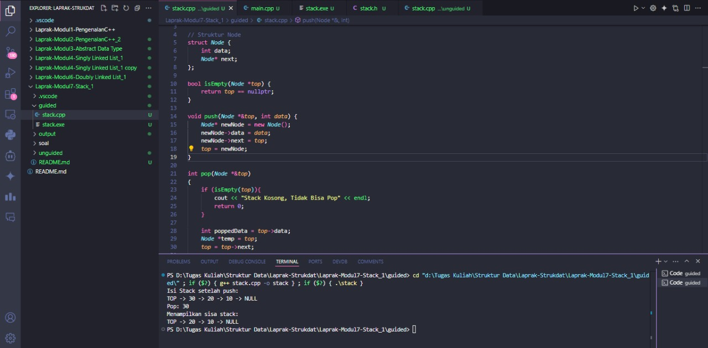
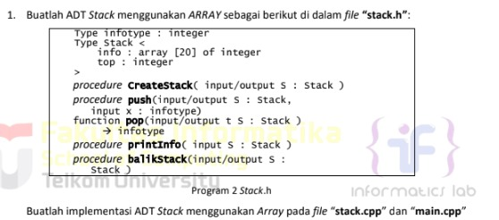
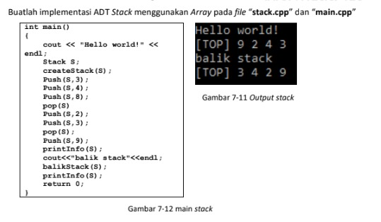
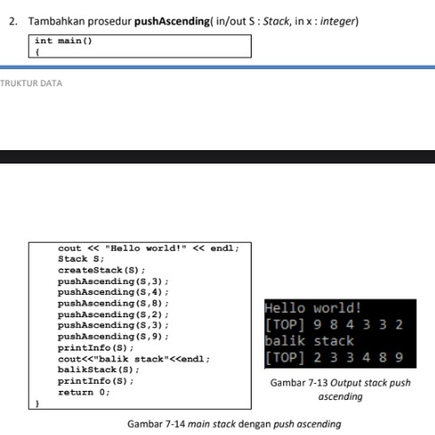
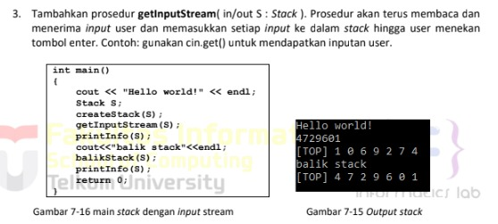
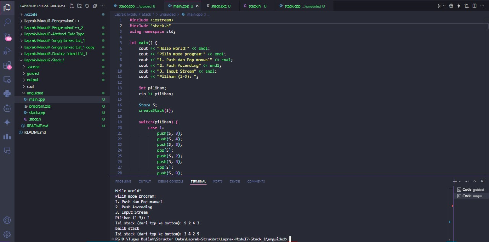
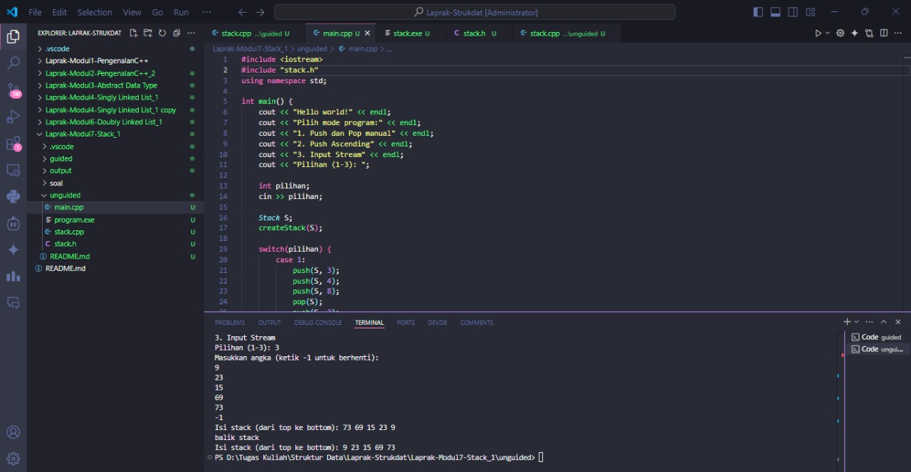
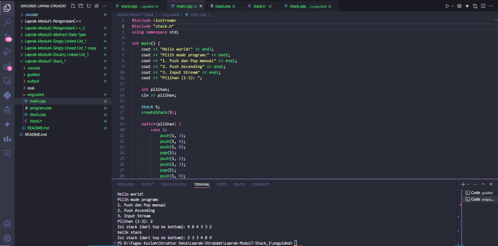

# <h1 align="center">Laporan Praktikum Modul 7<br>Stack</h1>
<p align="center">Arkaan Wisnu Pratama - 103112430118</p>

## Dasar Teori

Stack adalah struktur data linear yang konsep kerjanya mirip tumpukan. Elemen yang terakhir dimasukkan akan jadi elemen pertama yang diambil lagi. Prinsip ini disebut LIFO (Last In First Out). Jadi semua operasi di stack cuma dilakukan lewat satu titik: bagian atas yang disebut TOP.

Di dalam stack, tiap elemen disimpan secara berurutan, dan aksesnya terbatas — kamu gak bisa ambil elemen di tengah atau bawah, cuma bisa dari TOP saja. Karena itu stack lebih terkontrol tapi juga lebih ketat cara pakainya.

Dua operasi utama dalam stack:
Push → masukin elemen ke atas stack.
Pop → ngambil elemen paling atas dari stack.

Struktur stack bisa dibangun pakai pointer (mirip linked list) atau array (indeks TOP naik turun). Kalau pakai pointer, tiap elemen punya info dan next. Kalau pakai array, stack punya batas kapasitas.

Stack biasanya dipake buat hal-hal yang butuh urutan balik, misal: undo, pengecekan kurung di ekspresi, fungsi rekursi, dan penyimpanan state sementara.

## Guided

### soal 1 Linked List

```C++
#include <iostream>
using namespace std;

// Struktur Node
struct Node {
    int data;
    Node* next;
};

bool isEmpty(Node *top) {
    return top == nullptr;
}

void push(Node *&top, int data) {
    Node* newNode = new Node();
    newNode->data = data;
    newNode->next = top;
    top = newNode;
}

int pop(Node *&top)
{
    if (isEmpty(top)){
        cout << "Stack Kosong, Tidak Bisa Pop" << endl;
        return 0;
    }

    int poppedData = top->data;
    Node *temp = top;
    top = top->next;

    delete temp;
    return poppedData;
}

void show(Node *top) {
    if (isEmpty(top)) {
        cout << "Stack kosong.\n";
        return;
    }

    cout << "TOP -> ";
    Node *temp = top;

    while (temp != nullptr) {
        cout << temp->data << " -> ";
        temp = temp->next;
    }
    cout << "NULL" << endl;
}

int main(){
    Node *stack = nullptr;

    push(stack, 10);
    push(stack, 20);
    push(stack, 30);

    cout << "Isi Stack setelah push:\n";
    show(stack);

    cout << "Pop: " << pop(stack) << endl;

    cout << "Menampilkan sisa stack: \n";
    show(stack);

    return 0;

}
```
Program di atas adalah implementasi struktur data Stack berbasis Single Linked List di C++. Stack ini bekerja dengan prinsip LIFO, jadi data yang terakhir masuk bakal jadi yang pertama keluar. Setiap elemen disimpan dalam node yang punya dua bagian: nilai data dan pointer next yang nunjuk ke elemen di bawahnya. Program ini menyediakan operasi dasar stack seperti push buat nambah data ke bagian paling atas, pop buat ngambil dan menghapus data teratas, serta show buat nampilin seluruh isi stack dari TOP sampai elemen paling bawah. Semua proses pengelolaan stack dilakukan dengan manipulasi pointer, sehingga ukuran stack bisa fleksibel tanpa batasan kapasitas tetap seperti array. Program ini cocok dipakai buat latihan memahami cara kerja alokasi dinamis dan alur data satu arah pada struktur stack.

> 

Hasil dari output Guided

## Unguided

### Soal Stack

> 
> 
> 
> 

```C++
#include <iostream>
#include "stack.h"
using namespace std;

int main() {
    cout << "Hello world!" << endl;
    cout << "Pilih mode program:" << endl;
    cout << "1. Push dan Pop manual" << endl;
    cout << "2. Push Ascending" << endl;
    cout << "3. Input Stream" << endl;
    cout << "Pilihan (1-3): ";
    
    int pilihan;
    cin >> pilihan;
    
    Stack S;
    createStack(S);
    
    switch(pilihan) {
        case 1:
            push(S, 3);
            push(S, 4);
            push(S, 8);
            pop(S);
            push(S, 2);
            push(S, 3);
            pop(S);
            push(S, 9);
            
            printInfo(S);
            
            cout << "balik stack" << endl;
            balikStack(S);
            
            printInfo(S);
            break;
            
        case 2:
            pushAscending(S, 3);
            pushAscending(S, 4);
            pushAscending(S, 8);
            pushAscending(S, 2);
            pushAscending(S, 3);
            pushAscending(S, 9);
            
            printInfo(S);
            
            cout << "balik stack" << endl;
            balikStack(S);
            
            printInfo(S);
            break;
            
        case 3:
            getInputStream(S);
            
            printInfo(S);
            
            cout << "balik stack" << endl;
            balikStack(S);
            
            printInfo(S);
            break;
            
        default:
            cout << "Pilihan tidak valid!" << endl;
            break;
    }
    
    return 0;
}
```
Program di atas adalah implementasi stack berbasis array yang menyediakan tiga mode penggunaan berbeda sesuai pilihan user. Stack ini bekerja dengan prinsip LIFO, di mana data yang terakhir masuk bakal jadi yang pertama keluar. User bisa pilih mode push-pop manual, push ascending (data otomatis dimasukkan dalam urutan naik), atau input stream yang ngambil input karakter satu per satu sampai user menekan enter. Setelah stack terisi, program bakal nampilin isi stack lewat printInfo() dan kemudian membalik urutan stack menggunakan balikStack(), lalu menampilkannya lagi. Semua operasi seperti push, pop, dan pembalikan stack dilakukan dengan ngatur indeks TOP di array, sehingga prosesnya cepat dan terstruktur. Program ini cocok buat nunjukin cara kerja stack dengan beberapa variasi operasi dalam satu aplikasi interaktif sederhana.

```C++
#include "stack.h"
#include <iostream>
using namespace std;

void createStack(Stack &S) {
    S.top = -1;
}

bool isEmpty(Stack S) {
    return S.top == -1;
}

bool isFull(Stack S) {
    return S.top == MAX - 1;
}

void push(Stack &S, infotype x) {
    if (isFull(S)) {
        cout << "Stack penuh! Tidak bisa push " << x << endl;
    } else {
        S.top++;
        S.info[S.top] = x;
    }
}

infotype pop(Stack &S) {
    infotype x = -1;
    if (isEmpty(S)) {
        cout << "Stack kosong! Tidak bisa pop" << endl;
    } else {
        x = S.info[S.top];
        S.top--;
    }
    return x;
}

void printInfo(Stack S) {
    if (isEmpty(S)) {
        cout << "Stack kosong" << endl;
    } else {
        cout << "Isi stack (dari top ke bottom): ";
        for (int i = S.top; i >= 0; i--) {
            cout << S.info[i];
            if (i > 0) cout << " ";
        }
        cout << endl;
    }
}

void balikStack(Stack &S) {
    if (!isEmpty(S)) {
        Stack temp;
        createStack(temp);
        
        while (!isEmpty(S)) {
            push(temp, pop(S));
        }
        
        S = temp;
    }
}

void pushAscending(Stack &S, infotype x) {
    if (isFull(S)) {
        cout << "Stack penuh! Tidak bisa push " << x << endl;
        return;
    }
    
    if (isEmpty(S)) {
        push(S, x);
    } else {
        Stack temp;
        createStack(temp);
        
        while (!isEmpty(S) && S.info[S.top] > x) {
            push(temp, pop(S));
        }
        
        push(S, x);
        
        while (!isEmpty(temp)) {
            push(S, pop(temp));
        }
    }
}

void getInputStream(Stack &S) {
    cout << "Masukkan angka (ketik -1 untuk berhenti):" << endl;
    infotype x;
    
    while (true) {
        cin >> x;
        if (x == -1) {
            break;
        }
        if (isFull(S)) {
            cout << "Stack penuh! Input dihentikan." << endl;
            break;
        }
        push(S, x);
    }
}
```
Program di atas adalah implementasi stack berbasis array yang ngatur data dengan prinsip LIFO. Stack disimpen dalam struct yang punya array info dan variabel top sebagai penanda posisi elemen paling atas. Fungsi createStack() dipakai buat inisialisasi awal dengan nilai top = -1. Program nyediain operasi dasar kayak push buat masukin data, pop buat ngambil data teratas, dan printInfo buat nampilin isi stack dari top ke bottom. Ada juga fitur tambahan seperti balikStack() yang ngebalikin urutan isi stack menggunakan stack sementara, pushAscending() yang masukin data tapi tetap ngejaga urutan supaya selalu naik, dan getInputStream() yang ngambil input user sampai user berhenti sendiri. Semua operasi dilakukan dengan ngatur indeks top, jadi prosesnya cepat dan simpel sesuai karakteristik stack berbasis array.

```cpp
    #ifndef STACK_H
    #define STACK_H

    #define MAX 20
    typedef int infotype;

    typedef struct {
        infotype info[MAX];
        int top;
    } Stack;

    void createStack(Stack &S);
    bool isEmpty(Stack S);
    bool isFull(Stack S);
    void push(Stack &S, infotype x);
    infotype pop(Stack &S);
    void printInfo(Stack S);
    void balikStack(Stack &S);
    void pushAscending(Stack &S, infotype x);
    void getInputStream(Stack &S);

    #endif
```
File header di atas berisi definisi ADT Stack yang pakai array sebagai tempat nyimpen data. Stack punya kapasitas maksimal sebanyak 20 elemen, dan setiap datanya disimpan dalam tipe infotype yang berupa integer. Struktur Stack sendiri isinya array info buat menampung data dan variabel top buat nandain posisi elemen paling atas. Di header ini juga dideklarasikan semua fungsi yang bakal dipakai di implementasi, mulai dari operasi dasar seperti createStack, push, pop, sampai operasi tambahan seperti balikStack, pushAscending, dan getInputStream. Intinya, file ini jadi blueprint dari seluruh fungsi yang ngatur cara kerja stack biar lebih rapih, modular, dan gampang dipakai di file lain.

> 
> 
> 

## Referensi
1. Zhang, H., Wang, S., Li, H., Chen, T. H., & Hassan, A. E. (2021). A study of c/c++ code weaknesses on stack overflow. IEEE Transactions on Software Engineering, 48(7), 2359-2375.
2. Korostinskiy, R., Darashkevich, E., Rusyaev, R., & Bugayenko, Y. (2024). Heap vs. Stack: Analyzing Memory Allocations in C and C++ Open Source Software. arXiv preprint arXiv:2403.06695.
3. Ford, W., William, F., & Topp, W. (1995). Data structures with C++. Simon & Schuster, Inc..
