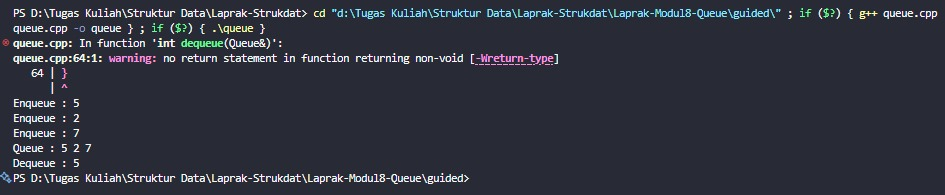
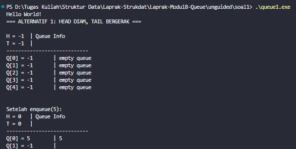
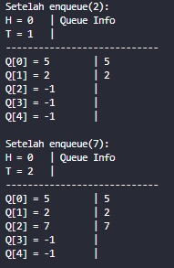
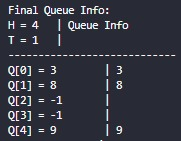

# <h1 align="center">Laporan Praktikum Modul 8<br>Queue</h1>
<p align="center">Arkaan Wisnu Pratama - 103112430118</p>

## Dasar Teori
Queue (dibaca : kyu) merupakan struktur data yang dapat diumpamakan seperti sebuah antrean. Misalkan antrean pada loket pembelian tiket Kereta Api. Orang yang akan mendapatkan pelayanan yang pertama adalah orang pertamakali masuk dalam antrean tersebut dan yang terakhir masuk dia akan mendapatkan layanan yang terakhir pula. Jadi prinsip dasar dalam Queue adalah FIFO (First in Fisrt out), proses yang pertama masuk akan diakses terlebih dahulu. Dalam pengimplementasian struktur Queue dalam C dapat menggunakan tipe data array dan linked list.

Dalam praktikum ini hanya akan dibahas pengimplementasian Queue dalam bentuk linked list. Implementasi Queue dalam linked list sebenarnya tidak jauh berbeda dengan operasi list biasa, malahan lebih sederhana. Karena sesuai dengan sifat FIFO dimana proses delete hanya dilakukan pada bagian Head (depan list) dan proses insert selalu dilakukan pada bagian Tail (belakang list) atau sebaliknya, tergantung dari persepsi masing-masing. Dalam penerapannya Queue dapat diterapkan dalam Singly linked list dan Doubly linked list.

## Guided

### Queue

```C++
#include <iostream>
using namespace std;
#define MAX 100

struct Queue {
    int data[MAX];
    int head;
    int tail;
}; 

void createQueue(Queue &Q) {
    Q.head = -1;
    Q.tail = -1;
}

bool isEmpty(Queue Q) {
    return (Q.head == -1 && Q.tail == -1);
}

bool isFull(Queue Q) {
    return (Q.tail == MAX - 1);
}

void printQueue(Queue Q) {
    if (isEmpty(Q)) {
        cout << "Queue kosong!" << endl;
    } else {
        cout << "Queue : ";
        for (int i = Q.head; i <= Q.tail; i++) {
            cout << Q.data[i] << " ";
        }
        cout << endl;
    }
}

void enqueue(Queue &Q, int x) {
    if (isFull(Q)) {
        cout << "Queue penuh!" << endl;
    } else {
        if (isEmpty(Q)) {
            Q.head = Q.tail = 0;
        } else {
            Q.tail++;
        }
        Q.data[Q.tail] = x;
        cout << "Enqueue : " << x << endl;
    }
}

int dequeue(Queue &Q) {
    if (isEmpty(Q)) {
        cout << "Queue kosong!" << endl; 
    } else {
        cout << "Dequeue : " << Q.data[Q.head] << endl;
        if (Q.head == Q.tail) {
            Q.head = Q.tail = -1; 
        } else {
            for (int i = Q.head; i < Q.tail; i++) {
                Q.data[i] = Q.data[i + 1];
            }
            Q.tail--;
        }
    }
}

int main() {
    Queue Q;
    createQueue(Q);
    
    enqueue(Q, 5);
    enqueue(Q, 2);
    enqueue(Q, 7);
    printQueue(Q);
    
    dequeue(Q);
    printQueue(Q);
    
    enqueue(Q, 4);
    enqueue(Q, 9);
    printQueue(Q);
    
    dequeue(Q);
    dequeue(Q);
    dequeue(Q);
    printQueue(Q);
    
    return 0;
}
```
Program ini ngerjain implementasi Queue sederhana pakai array dengan kapasitas maksimal 100 data. Queue-nya pakai konsep FIFO, jadi data yang masuk duluan bakal keluar duluan. Ada fungsi buat ngecek apakah queue kosong atau penuh, terus operasi utamanya ada enqueue buat masukin data ke belakang dan dequeue buat ngambil data paling depan. Proses dequeue di sini juga geser elemen biar posisi head tetap di index 0. Di bagian main, program nunjukkin contoh penggunaan queue mulai dari masukin data, ngeluarin data, sampai kondisi queue terakhir setelah beberapa operasi.

> 

## Unguided

### Soal Queue1

```C++
#include "queue.h"

int main() {
    Queue Q;
    
    cout << "Hello World!" << endl;
    cout << "=== ALTERNATIF 1: HEAD DIAM, TAIL BERGERAK ===" << endl;
    cout << endl;
    
    createQueue(Q);
    
    printInfo(Q);
    cout << endl;
    
    enqueue(Q, 5); 
    cout << "\nSetelah enqueue(5):" << endl;
    printInfo(Q);
    
    enqueue(Q, 2); 
    cout << "\nSetelah enqueue(2):" << endl;
    printInfo(Q);
    
    enqueue(Q, 7); 
    cout << "\nSetelah enqueue(7):" << endl;
    printInfo(Q);
    cout << endl;
    
    dequeue(Q); 
    cout << "\nSetelah dequeue():" << endl;
    printInfo(Q);
    
    dequeue(Q); 
    cout << "\nSetelah dequeue():" << endl;
    printInfo(Q);
    cout << endl;
    
    enqueue(Q, 1); 
    cout << "\nSetelah enqueue(1):" << endl;
    printInfo(Q);
    
    dequeue(Q); 
    cout << "\nSetelah dequeue():" << endl;
    printInfo(Q);
    
    dequeue(Q); 
    cout << "\nSetelah dequeue():" << endl;
    printInfo(Q);
    
    return 0;
}
```

```C++
#include "queue.h"

void createQueue(Queue &Q) {
    Q.head = -1;
    Q.tail = -1;
}

bool isEmptyQueue(Queue Q) {
    return (Q.head == -1 && Q.tail == -1);
}

bool isFullQueue(Queue Q) {
    return (Q.tail == 4);
}

void enqueue(Queue &Q, infotype x) {
    if (isFullQueue(Q)) {
        cout << "Queue penuh!" << endl;
    } else {
        if (isEmptyQueue(Q)) {
            Q.head = 0;
            Q.tail = 0;
        } else {
            Q.tail++;
        }
        Q.info[Q.tail] = x;
    }
}

void dequeue(Queue &Q) {
    if (isEmptyQueue(Q)) {
        cout << "Queue kosong!" << endl;
    } else {
        if (Q.head == Q.tail) {
            Q.head = -1;
            Q.tail = -1;
        } else {
            for (int i = 0; i < Q.tail; i++) {
                Q.info[i] = Q.info[i + 1];
            }
            Q.tail--;
        }
    }
}

void printInfo(Queue Q) {
    cout << "H = " << Q.head << " \t| Queue Info" << endl;
    cout << "T = " << Q.tail << " \t|" << endl;
    cout << "----------------------------" << endl;
    
    for (int i = 0; i < 5; i++) {
        cout << "Q[" << i << "] = ";
        if (isEmptyQueue(Q)) {
            cout << "-1\t| empty queue";
        } else if (i >= Q.head && i <= Q.tail) {
            cout << Q.info[i] << "\t| " << Q.info[i];
        } else {
            cout << "-1\t|";
        }
        cout << endl;
    }
}
```

```cpp
#ifndef QUEUE_H
#define QUEUE_H

#include <iostream>
using namespace std;

typedef int infotype;

struct Queue {
    infotype info[5];
    int head, tail;
};

void createQueue(Queue &Q);
bool isEmptyQueue(Queue Q);
bool isFullQueue(Queue Q);
void enqueue(Queue &Q, infotype x);
void dequeue(Queue &Q);
void printInfo(Queue Q);

#endif
```
Program ini nyediain implementasi queue sederhana dengan ukuran tetap, di mana head tetap diam dan tail yang bergerak setiap kali enqueue. Data baru selalu dimasukin ke posisi tail, dan kalau dequeue, elemen paling depan dihapus lalu semua elemen digeser biar urut lagi. Ada fungsi buat ngecek apakah queue kosong atau penuh, terus printInfo dipakai buat nunjukkin posisi head, tail, dan isi array secara jelas. Di main, program ngejalanin beberapa operasi enqueue dan dequeue biar kelihatan perubahan isi queue setelah tiap langkah. Secara keseluruhan, program ini bantu nunjukkin cara kerja queue model FIFO dengan tampilan yang gampang dipahami.
> 

### Soal Queue2

```C++
#include "queue.h"

int main() {
    Queue Q;
    
    cout << "Hello World!" << endl;
    cout << "=== ALTERNATIF 2: HEAD BERGERAK, TAIL BERGERAK ===" << endl;
    cout << endl;
    
    createQueue(Q);
    
    printInfo(Q);
    cout << endl;
    
    enqueue(Q, 5); 
    cout << "\nSetelah enqueue(5):" << endl;
    printInfo(Q);
    
    enqueue(Q, 2); 
    cout << "\nSetelah enqueue(2):" << endl;
    printInfo(Q);
    
    enqueue(Q, 7); 
    cout << "\nSetelah enqueue(7):" << endl;
    printInfo(Q);
    cout << endl;
    
    dequeue(Q); 
    cout << "\nSetelah dequeue():" << endl;
    printInfo(Q);
    
    dequeue(Q); 
    cout << "\nSetelah dequeue():" << endl;
    printInfo(Q);
    cout << endl;
    
    enqueue(Q, 1); 
    cout << "\nSetelah enqueue(1):" << endl;
    printInfo(Q);
    
    dequeue(Q); 
    cout << "\nSetelah dequeue():" << endl;
    printInfo(Q);
    
    dequeue(Q); 
    cout << "\nSetelah dequeue():" << endl;
    printInfo(Q);
    
    return 0;
}
```

```C++
#include "queue.h"

void createQueue(Queue &Q) {
    Q.head = -1;
    Q.tail = -1;
}

bool isEmptyQueue(Queue Q) {
    return (Q.head == -1 && Q.tail == -1);
}

bool isFullQueue(Queue Q) {
    return (Q.tail == 4);
}

void enqueue(Queue &Q, infotype x) {
    if (isFullQueue(Q)) {
        cout << "Queue penuh!" << endl;
    } else {
        if (isEmptyQueue(Q)) {
            Q.head = 0;
            Q.tail = 0;
        } else {
            Q.tail++;
        }
        Q.info[Q.tail] = x;
    }
}

void dequeue(Queue &Q) {
    if (isEmptyQueue(Q)) {
        cout << "Queue kosong!" << endl;
    } else {
        if (Q.head == Q.tail) {
            Q.head = -1;
            Q.tail = -1;
        } else {
            Q.head++;
        }
    }
}

void printInfo(Queue Q) {
    cout << "H = " << Q.head << " \t| Queue Info" << endl;
    cout << "T = " << Q.tail << " \t|" << endl;
    cout << "----------------------------" << endl;
    
    for (int i = 0; i < 5; i++) {
        cout << "Q[" << i << "] = ";
        if (isEmptyQueue(Q)) {
            cout << "-1\t| empty queue";
        } else if (i >= Q.head && i <= Q.tail) {
            cout << Q.info[i] << "\t| " << Q.info[i];
        } else {
            cout << "-1\t|";
        }
        cout << endl;
    }
}
```

```cpp
#ifndef QUEUE_H
#define QUEUE_H

#include <iostream>
using namespace std;

typedef int infotype;

struct Queue {
    infotype info[5];
    int head, tail;
};

void createQueue(Queue &Q);
bool isEmptyQueue(Queue Q);
bool isFullQueue(Queue Q);
void enqueue(Queue &Q, infotype x);
void dequeue(Queue &Q);
void printInfo(Queue Q);

#endif
```
Program ini ngejalanin implementasi queue dengan model alternatif kedua, yaitu head dan tail sama-sama bisa bergerak sesuai operasi yang dilakukan. Saat enqueue, tail maju dan data baru masuk ke posisi tersebut, sedangkan saat dequeue, head maju tanpa perlu geser semua elemen. Fungsi pendukung seperti pengecekan queue kosong atau penuh dan printInfo dipakai buat nunjukkin perubahan posisi head, tail, dan isi array secara jelas. Di bagian main, program ngejalanin beberapa enqueue dan dequeue untuk nunjukkin gimana antrian berubah dari waktu ke waktu. Secara keseluruhan, program ini ngasih gambaran yang simpel tentang cara kerja queue FIFO dengan head dan tail yang dinamis.
> 

### Soal Queue3

```C++
#include "queue.h"

int main() {
    Queue Q;
    
    cout << "=== ALTERNATIF 3: HEAD BERGERAK, TAIL DIAM (CIRCULAR) ===" << endl;
    cout << endl;
    
    createQueue(Q);
    
    cout << "Queue Info:" << endl;
    printInfo(Q);
    cout << endl;
    
    enqueue(Q, 5); printInfo(Q);
    enqueue(Q, 2); printInfo(Q);
    enqueue(Q, 7); printInfo(Q);
    cout << endl;
    
    dequeue(Q); printInfo(Q);
    dequeue(Q); printInfo(Q);
    cout << endl;
    
    enqueue(Q, 1); printInfo(Q);
    enqueue(Q, 9); printInfo(Q);
    enqueue(Q, 3); printInfo(Q);
    cout << endl;
    
    cout << "Coba enqueue lagi (harusnya penuh):" << endl;
    enqueue(Q, 8);
    cout << endl;
    
    dequeue(Q); printInfo(Q);
    dequeue(Q); printInfo(Q);
    cout << endl;
    
    cout << "Final Queue Info:" << endl;
    printInfo(Q);
    
    return 0;
}
```

```C++
#include "queue.h"

void createQueue(Queue &Q) {
    Q.head = -1;
    Q.tail = -1;
}

bool isEmptyQueue(Queue Q) {
    return (Q.head == -1 && Q.tail == -1);
}

bool isFullQueue(Queue Q) {
    return ((Q.tail + 1) % 5 == Q.head);
}

void enqueue(Queue &Q, infotype x) {
    if (isFullQueue(Q)) {
        cout << "Queue penuh!" << endl;
    } else {
        if (isEmptyQueue(Q)) {
            Q.head = 0;
            Q.tail = 0;
        } else {
            Q.tail = (Q.tail + 1) % 5;
        }
        Q.info[Q.tail] = x;
    }
}

void dequeue(Queue &Q) {
    if (isEmptyQueue(Q)) {
        cout << "Queue kosong!" << endl;
    } else {
        if (Q.head == Q.tail) {
            Q.head = -1;
            Q.tail = -1;
        } else {
            Q.head = (Q.head + 1) % 5;
        }
    }
}

void printInfo(Queue Q) {
    cout << "H = " << Q.head << " \t| Queue Info" << endl;
    cout << "T = " << Q.tail << " \t|" << endl;
    cout << "----------------------------" << endl;
    
    for (int i = 0; i < 5; i++) {
        cout << "Q[" << i << "] = ";
        if (isEmptyQueue(Q)) {
            cout << "-1\t| empty queue";
        } else {
            bool hasData = false;
            int idx = Q.head;
            while (true) {
                if (idx == i) {
                    hasData = true;
                    break;
                }
                if (idx == Q.tail) break;
                idx = (idx + 1) % 5;
            }
            
            if (hasData) {
                cout << Q.info[i] << "\t| " << Q.info[i];
            } else {
                cout << "-1\t|";
            }
        }
        cout << endl;
    }
}
```

```cpp
#ifndef QUEUE_H
#define QUEUE_H

#include <iostream>
using namespace std;

typedef int infotype;

struct Queue {
    infotype info[5];
    int head, tail;
};

void createQueue(Queue &Q);
bool isEmptyQueue(Queue Q);
bool isFullQueue(Queue Q);
void enqueue(Queue &Q, infotype x);
void dequeue(Queue &Q);
void printInfo(Queue Q);

#endif
```
Pada program Queue alternatif 3 ini, konsep yang dipakai adalah circular queue, di mana indeks head dan tail bergerak melingkar menggunakan operasi modulo. Ketika queue kosong, head dan tail diset ke -1, sedangkan queue dianggap penuh jika posisi (tail + 1) % 5 bertemu dengan head. Proses enqueue akan menempatkan data baru pada posisi tail, dan jika tail mencapai akhir array, ia akan kembali ke indeks 0 tanpa perlu menggeser elemen. Sebaliknya, operasi dequeue cukup menggeser head ke indeks berikutnya secara melingkar, dan jika head bertemu tail, queue otomatis menjadi kosong kembali. Desain ini membuat operasi antrean lebih efisien karena tidak perlu memindahkan elemen di dalam array.

> 

## Referensi
1. Juliansyah, N., Sari, S. Y., & Dristyan, F. (2024). Optimasi Struktur Data Stack dan Queue Menggunakan Array Dinamis. Fusion: Journal of Research in Engineering, Technology and Applied Sciences, 1(2), 90-97. https://ejurnal.faaslibsmedia.com/index.php/fusion/article/view/264

2. Anita Sindar, R. M. S. (2019). Struktur Data Dan Algoritma Dengan C++ (Vol. 1). CV. AA. RIZKY. https://books.google.com/books?hl=en&lr=&id=GP_ADwAAQBAJ&oi=fnd&pg=PA23&dq=stack+pada+c%2B%2B&ots=86k4Nl2OhV&sig=0KNR8rE2WYaLliEAZmi71x2eU7k

3. Santoso, L. E. (2004). STANDARD TEMPLATE LIBRARY C++ UNTUK MENGAJARKAN STRUKTUR DATA. Jurnal FASILKOM Vol, 2(2). https://www.academia.edu/download/56411324/standard-template-library-c__-untuk-mengajarkan-struktur-data.pdf
